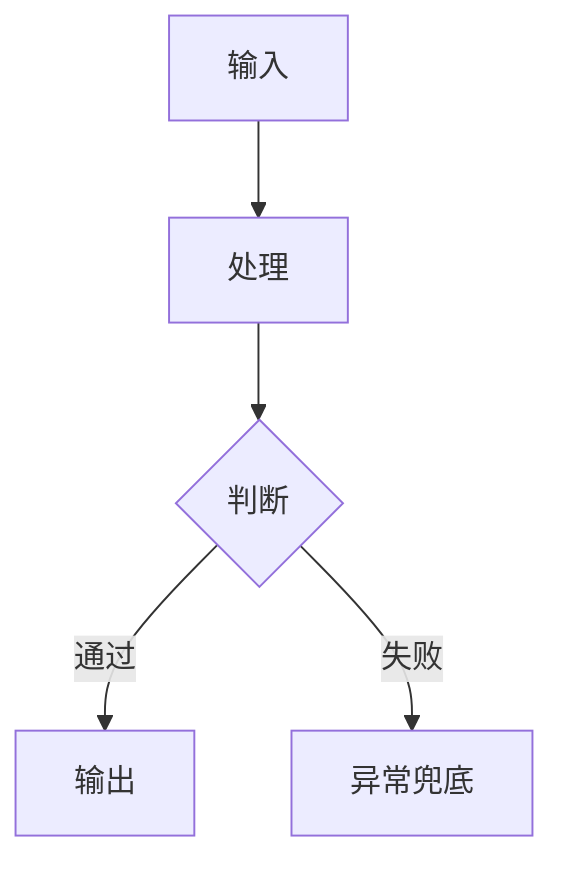

# AGENTS.md

## 项目定位

本项目是面向 **AI 自动化工程师（跨境电商 / 数据报表自动化方向）求职** 的个人作品集项目。

当前核心主线不是泛泛学习工具，而是：

- 用飞书多维表格理解跨境电商 ERP 业务流程。
- 用 mock CSV 数据复现商品、订单、库存、补货、异常等业务对象。
- 用 Python/Pandas 把表格数据处理成可解释、可展示、可面试讲解的业务报表。
- 最终沉淀为 AI 自动化工程师 / 数据自动化助理方向的求职作品。

当前阶段重点：

> 已完成飞书 ERP 工作台搭建，正在进行 Python/Pandas 数据报表自动化的“理解复盘”。

## 当前主线文件

后续 AI / Codex 进入本项目时，优先阅读这些文件：

- `README.md`
- `task-plans/01-overall-roadmap.md`
- `task-plans/04-ai-automation-engineer-roadmap.md`
- `task-plans/05-python-pandas-data-cleaning-plan.md`
- `docs/Python学习.md`

当前主要数据文件：

- `data/products.csv`
- `data/orders.csv`
- `data/inventory.csv`
- `data/replenishment.csv`
- `data/exceptions.csv`

当前主要脚本：

- `scripts/erp_data_cleaning_demo.py`

## 协作习惯

全程使用中文沟通，专业术语可保留英文。

回答必须简洁、清晰、可执行。不要空泛鼓励，不要直接堆完整方案。

每一步必须先说明：

1. 为什么要做这一步
2. 这一步解决什么业务问题
3. 输入是什么
4. 输出是什么
5. 和当前计划有什么关系

如果用户问“下一步做什么”，必须先说明原因，再给下一步。

如果用户说“不明白”，优先用业务语言重新解释，不要马上继续写代码。

## Python 学习规则

用户不是以程序员视角学习 Python，而是以 **业务流程 / 表格处理 / 自动化报表** 的视角学习 Python。

Python 阶段固定采用以下方式：

1. 先确认业务问题，不先写代码。
2. 再把业务步骤拆成 3-5 个表格处理步骤。
3. 每次只给一小段 Python。
4. 每一行代码都用“业务意思”解释。
5. 用户确认理解后，再进入下一小步。
6. 不要一次性输出完整脚本让用户硬看。

正确示例：

```text
业务问题：
我想确认 orders.csv 订单表能不能被 Python 读取，并查看前 5 行。

表格步骤：
1. 读取订单表
2. 查看字段
3. 查看前 5 行
4. 确认数据是否正常
```

禁止示例：

```text
直接生成完整 ERP 数据清洗项目。
```

## 当前优先任务

当前 Python/Pandas 阶段按以下顺序理解复盘：

1. 理解 `products.csv` 是 SKU 主表。
2. 检查 5 张 CSV 的 SKU 是否匹配。
3. 理解订单汇总：按 SKU / 平台统计数量和销售额。
4. 理解库存预警：当前库存、安全库存、低库存、缺货。
5. 理解补货建议：缺口数量、补货原因、系统建议。
6. 理解异常汇总：异常类型、影响订单号、处理状态。
7. 最后再整理成可面试讲解的作品说明。

判断学习是否完成，不看脚本是否已经由 AI 跑通，而看用户是否能用业务语言说清楚：

- 输入表是什么
- 输出表是什么
- 中间处理了什么
- 为什么这个报表有业务价值

## 执行边界

当前阶段不要提前扩展到复杂自动化。

暂时不要做：

- 真实 ERP API 接入
- 平台 API 接入
- n8n / Make 工作流
- RPA 自动点击
- SaaS 产品化
- 大而全的自动化系统
- 脱离当前业务场景的 Python 大项目

当前优先做：

- 飞书多维表格理解
- CSV mock 数据
- Python/Pandas 小步骤理解
- 数据报表自动化
- JD 痛点反推
- 求职作品集包装

## Git 与数据安全规则

可以提交到 GitHub 的内容：

- `README.md`
- `AGENTS.md`
- `task-plans/`
- `data/` 中的 mock CSV 数据
- `scripts/` 中的练习脚本
- `outputs/` 中的 mock 输出报表
- 不含隐私信息的作品说明文档

不要擅自提交：

- 真实客户数据
- 真实订单数据
- 手机号、地址、账号、密码、密钥
- 用户个人隐私资料
- 未经用户确认的个人规划、天赋图、简历原始资料

如果工作区同时存在计划文件修改和个人资料文件，提交前必须区分：

```text
计划 / mock 数据 / 脚本：可以按用户要求提交
个人资料 / 隐私信息：必须先询问用户
```

## 输出风格

回答优先使用 Markdown。

涉及流程时，优先使用 Mermaid：



涉及代码时，只给当前小步骤需要的代码，并用业务语言解释。

涉及计划更新时，要明确写出：

- 当前做到哪里
- 下一步是什么
- 为什么做这一步
- 是否需要提交到 GitHub

