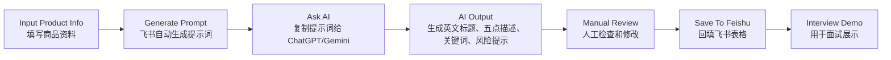
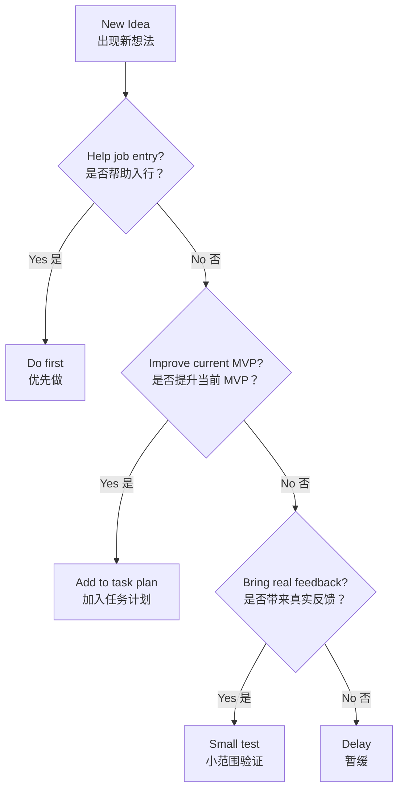

# Cross-Border E-Commerce AI Workflow Plan

> 中文说明：这是一个面向跨境电商入行、副业验证和 AI 工作流能力建设的个人项目。  
> 当前重点不是马上创业，也不是开发复杂系统，而是通过可展示的 MVP 和持续计划，逐步进入跨境电商真实业务场景。

## Project Goal（项目目标）

长期目标：

- Enter cross-border e-commerce industry（进入跨境电商行业）
- Build AI workflow capability（建立 AI 工作流能力）
- Create practical MVPs（做出可展示、可复用的最小作品）
- Turn workflow ability into side income（逐步把工作流能力转化为副业收入）
- Evaluate whether it can become a main business（未来评估是否主业化）

当前阶段目标：

> 做出一个能用于面试展示的跨境商品 Listing 半自动生成工作流，并围绕它学习飞书多维表格、Amazon Listing 基础和真实岗位需求。

## Current MVP（当前 MVP）

MVP 名称：

> Cross-Border Product Listing Semi-Automated Workflow  
> 跨境商品 Listing 半自动生成工作流

当前流程：



当前已经完成：

- 建立飞书多维表格。
- 完成 6 条商品 Listing 样本。
- 创建 `生成提示词` 公式字段。
- 初步跑通“商品资料 -> AI 提示词 -> Listing 输出 -> 回填表格”的半自动流程。

## Project Structure（项目结构）

```text
work-plan/
  README.md
  docs/
    招聘信息.md
  task-plans/
    01-overall-roadmap.md
    02-7-day-learning-plan.md
```

目录说明：

- `docs/`：存放市场信息、招聘信息、真实岗位需求等输入资料。
- `task-plans/`：存放长期计划、短期计划和后续阶段计划。
- `README.md`：项目入口，说明当前方向和文件结构。

## Main Documents（核心文档）

- [01-overall-roadmap.md](task-plans/01-overall-roadmap.md)  
  总体路线图，用于管理长期方向、阶段目标和关键决策。

- [02-7-day-learning-plan.md](task-plans/02-7-day-learning-plan.md)  
  7 天学习计划，用于把当前 MVP 升级成更适合面试展示的版本。

- [招聘信息.md](docs/招聘信息.md)  
  广州本地跨境电商 AI 自动化相关招聘样本和需求分析。

## Current Strategy（当前策略）

当前不建议直接做：

- SaaS 产品
- Python 自动化大项目
- n8n / Make / API 集成
- 高价企业咨询
- AI 培训课程

当前优先做：

1. Polish the MVP（打磨当前 MVP）
2. Learn Feishu workflow（学习飞书工作流）
3. Learn Amazon Listing basics（学习 Amazon Listing 基础）
4. Prepare an interview portfolio（准备面试作品展示）
5. Enter real business scenarios（进入真实业务场景）

## Decision Rule（决策规则）

遇到新想法时，用这个规则判断：



简单说：

> 不能帮助入行、不能提升当前 MVP、不能带来真实反馈的事情，先不做。

## Naming Rule（文件命名规则）

计划文档采用：

```text
数字-英文名称.md
```

示例：

- `01-overall-roadmap.md`
- `02-7-day-learning-plan.md`
- `03-interview-preparation.md`
- `04-30-day-action-plan.md`

规则：

- `01` 永远放总体方案。
- 后续计划按执行顺序递增。
- 文件名用英文，内容可以中英结合。
- 重要文档尽量加入流程图或示意图。

## Review Rhythm（复盘节奏）

每周复盘：

- What did I finish?（我完成了什么？）
- What did I learn?（我学到了什么？）
- What blocked me?（我卡在哪里？）
- What should I do next week?（下周做什么？）

每月更新：

- 总体路线是否需要调整？
- 当前 MVP 是否需要升级？
- 是否开始投递或面试？
- 是否出现真实业务机会？
- 是否需要新增计划文档？
