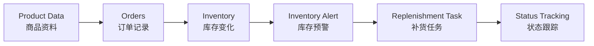
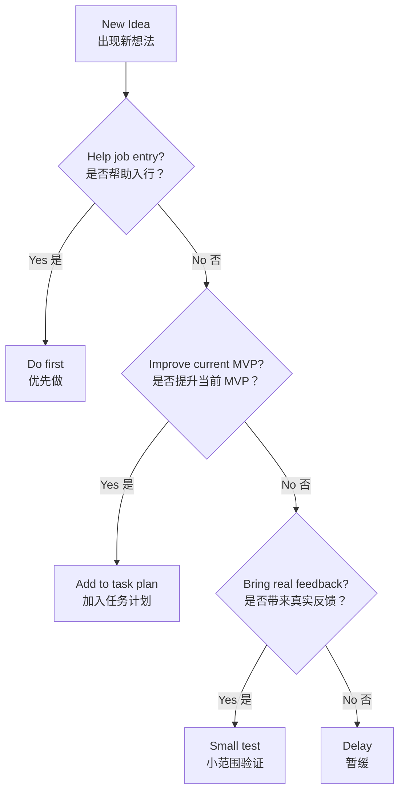

# Cross-Border E-Commerce ERP/Data Workflow Plan

> 中文说明：这是一个面向跨境电商数据/ERP/表格流程支持、副业验证和工作流能力建设的个人项目。  
> 当前重点不是继续包装 Listing 小工具，而是转向更接近真实岗位和付费需求的商品、订单、库存、补货、异常和报表流程。

## Project Goal（项目目标）

长期目标：

- Build ERP/data workflow capability（建立 ERP/数据流程能力）
- Understand cross-border e-commerce operations（理解跨境电商真实业务）
- Create practical workflow simulations（做出可展示、可复用的流程作品）
- Validate table/ERP cleanup service（验证表格/ERP整理服务）
- Evaluate whether it can become a main business（未来评估是否主业化）

当前阶段目标：

> 做出一个更接近真实岗位需求的跨境电商 ERP 流程模拟工作台，并用招聘 JD 反推企业在商品、订单、库存、补货和报表上的痛点。

## Current Portfolio Direction（当前作品方向）

已完成入门作品：

> Cross-Border Product Listing Semi-Automated Workflow  
> 跨境商品 Listing 半自动生成工作流

当前定位：

> 该作品用于证明飞书基础、字段设计和流程意识，但不再作为就业或副业竞争力核心。

下一阶段重点作品：

> Cross-Border ERP Workflow Simulation  
> 跨境电商 ERP 流程模拟工作台

目标流程：



当前已经完成：

- 完成 Listing 入门工作流。
- 完成飞书视图、表单、状态流转练习。
- 明确 Listing 小工具竞争力不足。
- 新策略转向 ERP/表格流程支持和副业服务验证。

## Project Structure（项目结构）

```text
work-plan/
  README.md
  docs/
    个人简历.md
    招聘信息.md
  task-plans/
    01-overall-roadmap.md
    02-3-day-feishu-workflow-practice.md
    03-erp-workflow-simulation-plan.md
```

目录说明：

- `docs/`：存放市场信息、招聘信息、真实岗位需求等输入资料。
- `task-plans/`：存放长期计划、短期计划和后续阶段计划。
- `README.md`：项目入口，说明当前方向和文件结构。

## Main Documents（核心文档）

- [01-overall-roadmap.md](task-plans/01-overall-roadmap.md)  
  总体路线图，用于管理长期方向、阶段目标和关键决策。

- [02-3-day-feishu-workflow-practice.md](task-plans/02-3-day-feishu-workflow-practice.md)  
  3 天飞书工作流练习计划，用于把当前 MVP 训练成更完整的小型工作流。

- [03-erp-workflow-simulation-plan.md](task-plans/03-erp-workflow-simulation-plan.md)  
  5 天 ERP 流程模拟计划，用于搭建更接近真实岗位需求的商品、订单、库存、补货和异常管理作品。

- [招聘信息.md](docs/招聘信息.md)  
  广州本地跨境电商招聘样本、JD 反推记录和 ERP/表格痛点分析。

- [个人简历.md](docs/个人简历.md)  
  数据/ERP/表格流程支持方向的长期维护简历。

## Current Strategy（当前策略）

当前不建议直接做：

- SaaS 产品
- Python 自动化大项目
- n8n / Make / API 集成
- 高价企业咨询
- AI 培训课程

当前优先做：

1. Build ERP workflow simulation（搭建 ERP 流程模拟作品）
2. Analyze job descriptions（分析招聘 JD）
3. Package table/ERP cleanup service（整理表格/ERP服务包）
4. Validate demand before selling automation（先验证需求，再谈自动化）
5. Enter real business scenarios（进入真实业务场景）

## Decision Rule（决策规则）

遇到新想法时，用这个规则判断：



简单说：

> 不能帮助入行、不能提升当前 MVP、不能带来真实反馈的事情，先不做。

## Naming Rule（文件命名规则）

计划文档采用：

```text
数字-英文名称.md
```

示例：

- `01-overall-roadmap.md`
- `02-3-day-feishu-workflow-practice.md`
- `03-erp-workflow-simulation-plan.md`
- `04-30-day-action-plan.md`

规则：

- `01` 永远放总体方案。
- 后续计划按执行顺序递增。
- 文件名用英文，内容可以中英结合。
- 重要文档尽量加入流程图或示意图。

## Review Rhythm（复盘节奏）

每周复盘：

- What did I finish?（我完成了什么？）
- What did I learn?（我学到了什么？）
- What blocked me?（我卡在哪里？）
- What should I do next week?（下周做什么？）

每月更新：

- 总体路线是否需要调整？
- 当前 MVP 是否需要升级？
- 是否开始投递或面试？
- 是否出现真实业务机会？
- 是否需要新增计划文档？
