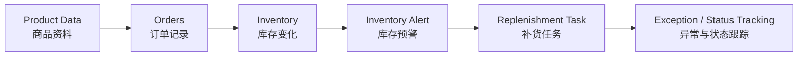
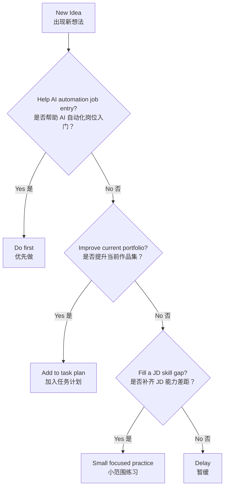

# Cross-Border E-Commerce AI Automation Engineer Portfolio Plan

> 中文说明：这是一个面向 **AI 自动化工程师（跨境电商方向）求职** 的个人作品集计划。  
> 当前重点不是继续包装 Listing 小工具，也不是优先卖表格整理服务，而是先用飞书多维表格复刻跨境电商业务流程，再逐步扩展到 Python 数据清洗、RPA/低代码自动化和 AI 工作流。

## Project Goal（项目目标）

长期目标：

- Build AI automation engineer portfolio（建立 AI 自动化工程师作品集）
- Understand cross-border e-commerce operations（理解跨境电商真实业务）
- Create practical ERP/data workflow simulations（做出可展示、可复用的 ERP/数据流程作品）
- Learn Python/Pandas/RPA/AI workflow based on real business scenarios（基于真实业务场景学习 Python、Pandas、RPA 和 AI 工作流）
- Prepare for AI automation engineer job applications（为 AI 自动化工程师岗位投递做准备）

当前阶段目标：

> 做出一个更接近真实岗位需求的跨境电商 ERP 流程模拟工作台，并用招聘 JD 反推 AI 自动化工程师需要补齐的业务、表格、数据清洗和自动化能力。

## Current Portfolio Direction（当前作品方向）

已完成入门作品：

> Cross-Border Product Listing Semi-Automated Workflow  
> 跨境商品 Listing 半自动生成工作流

当前定位：

> Listing 作品用于证明飞书基础、字段设计和流程意识，但不再作为求职竞争力核心。

当前重点作品：

> Cross-Border ERP Workflow Simulation  
> 跨境电商 ERP 流程模拟工作台

目标流程：



当前已经完成：

- 完成 Listing 入门工作流。
- 完成飞书视图、表单、状态流转练习。
- 明确 Listing 小工具竞争力不足。
- 新策略转向 AI 自动化工程师求职作品集建设。
- 已完成跨境电商 ERP 流程模拟工作台 Day 1-Day 4。
- 已建立 `data/` mock CSV 数据目录，用于飞书导入、作品展示和后续 Python/Pandas 数据清洗练习。
- 已启动 Python/Pandas 数据清洗 Demo，用代码复现 SKU 检查、订单汇总、库存预警、补货建议和异常汇总。

## Project Structure（项目结构）

```text
work-plan/
  README.md
  docs/
    个人简历.md
    招聘信息.md
    erp-workflow-portfolio.md
  data/
    products.csv
    orders.csv
    inventory.csv
    replenishment.csv
    exceptions.csv
  scripts/
    erp_data_cleaning_demo.py
  outputs/
    sku_check_report.csv
    order_summary_by_sku.csv
    order_summary_by_platform.csv
    inventory_alert_report.csv
    replenishment_suggestion.csv
    exception_summary.csv
  task-plans/
    01-overall-roadmap.md
    02-3-day-feishu-workflow-practice.md
    03-erp-workflow-simulation-plan.md
    04-ai-automation-engineer-roadmap.md
    05-python-pandas-data-cleaning-plan.md
  requirements.txt
```

目录说明：

- `docs/`：存放招聘信息、JD 反推、作品说明和简历相关资料。
- `data/`：存放 mock CSV 数据，用于飞书导入、作品展示和后续 Python/Pandas 练习。
- `scripts/`：存放 Python/Pandas 数据清洗脚本。
- `outputs/`：存放脚本生成的清洗结果和汇总报表。
- `task-plans/`：存放长期路线、阶段计划和后续能力路线。
- `requirements.txt`：记录当前 Python/Pandas Demo 需要的 Python 依赖。
- `README.md`：项目入口，说明当前方向和文件结构。

## Run Python/Pandas Demo（运行数据清洗 Demo）

```bash
python3 -m pip install -r requirements.txt
python3 scripts/erp_data_cleaning_demo.py
```

运行后会在 `outputs/` 生成 SKU 检查、订单汇总、库存预警、补货建议和异常汇总 CSV。

## Main Documents（核心文档）

- [01-overall-roadmap.md](task-plans/01-overall-roadmap.md)  
  总体路线图，用于管理 AI 自动化工程师求职方向、阶段目标和关键决策。

- [02-3-day-feishu-workflow-practice.md](task-plans/02-3-day-feishu-workflow-practice.md)  
  3 天飞书工作流练习计划，是 Listing 入门作品的复盘文档。

- [03-erp-workflow-simulation-plan.md](task-plans/03-erp-workflow-simulation-plan.md)  
  5 天 ERP 流程模拟计划，用于搭建更接近 AI 自动化岗位业务场景的商品、订单、库存、补货和异常管理作品。

- [04-ai-automation-engineer-roadmap.md](task-plans/04-ai-automation-engineer-roadmap.md)  
  AI 自动化工程师能力路线图，用于管理从飞书 ERP 作品到 Python、RPA、AI 工作流的后续学习路径。

- [05-python-pandas-data-cleaning-plan.md](task-plans/05-python-pandas-data-cleaning-plan.md)  
  7 天 Python/Pandas 数据清洗计划，用于把 ERP mock CSV 转化成可运行、可讲解的数据处理作品。

- [erp-workflow-portfolio.md](docs/erp-workflow-portfolio.md)  
  跨境电商 ERP 流程模拟工作台作品说明，用于求职作品集展示。

- [招聘信息.md](docs/招聘信息.md)  
  广州本地跨境电商 AI 自动化岗位样本、JD 反推记录和能力差距分析。

- [个人简历.md](docs/个人简历.md)  
  AI 自动化工程师方向的长期维护简历。

## Current Strategy（当前策略）

当前不建议直接做：

- SaaS 产品
- 脱离业务场景的 Python 自动化大项目
- 脱离作品集的 n8n / Make / API 集成
- 高价企业咨询
- AI 培训课程

当前优先做：

1. Build ERP workflow simulation（搭建 ERP 流程模拟作品）
2. Analyze AI automation engineer job descriptions（分析 AI 自动化工程师 JD）
3. Build Python/Pandas data cleaning demo with mock CSV（基于 mock CSV 做 Python/Pandas 数据清洗作品）
4. Add RPA/Feishu/Coze workflow demo after business flow is clear（业务流程清楚后再加 RPA/飞书/Coze 工作流）
5. Package a job-oriented portfolio（整理成求职作品集）

## Decision Rule（决策规则）

遇到新想法时，用这个规则判断：



简单说：

> 不能帮助 AI 自动化岗位入门、不能提升当前作品集、不能补齐 JD 能力差距的事情，先不做。

## Naming Rule（文件命名规则）

计划文档采用：

```text
数字-英文名称.md
```

示例：

- `01-overall-roadmap.md`
- `02-3-day-feishu-workflow-practice.md`
- `03-erp-workflow-simulation-plan.md`
- `04-ai-automation-engineer-roadmap.md`

规则：

- `01` 永远放总体方案。
- 后续计划按执行顺序递增。
- 文件名用英文，内容可以中英结合。
- 重要文档尽量加入流程图或示意图。

## Review Rhythm（复盘节奏）

每周复盘：

- What did I finish?（我完成了什么？）
- What did I learn?（我学到了什么？）
- What blocked me?（我卡在哪里？）
- What should I do next week?（下周做什么？）

每月更新：

- 当前作品集是否更接近 AI 自动化工程师岗位？
- 是否需要开始投递或面试？
- 是否补齐了新的 JD 能力差距？
- 是否需要学习 Python/Pandas/RPA/Coze 等新工具？
