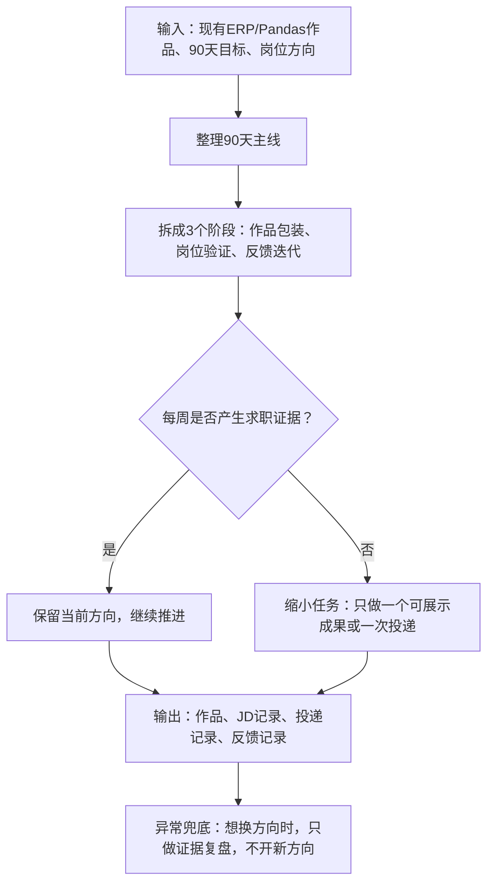

# 90天求职结果执行计划

## 核心原则

未来 90 天只围绕一条主线：

**用业务报表自动化作品，换取真实岗位反馈。**

我不是程序员。

我的定位是：

**业务需求描述者 + AI 实现协调者 + 结果验收者**

我负责：

- 发现业务问题
- 描述输入数据
- 说明判断规则
- 定义输出结果
- 检查结果是否正确
- 整理成作品和面试表达

AI 负责：

- 写代码
- 改代码
- 排错
- 解释实现

90 天内不追求大而全系统，只追求可验证结果。

---

## 一、90天主目标

主方向：

**业务报表自动化 / 流程自动化 / AI 自动化工程师求职**

90 天后至少要拥有：

- [ ] 1 套可讲解的跨境电商 ERP 数据报表自动化作品
- [ ] 1 份项目作品说明
- [ ] 1 份面试讲解稿
- [ ] 1 份匹配岗位方向的简历版本
- [ ] 30 个相关岗位 JD 分析
- [ ] 20-30 次岗位投递记录
- [ ] 3-5 条真实反馈记录
- [ ] 1 份 90 天复盘和下一阶段判断

辅助目标：

- [ ] 视频使用明显减少
- [ ] 睡前不再刷到凌晨 2 点
- [ ] 不再频繁换方向

判断标准：

> 不是我学了多少工具，而是我是否产生了作品、JD、投递、反馈这些证据。

---

## 二、90天执行主流程



---

## 三、三阶段路线

### 第 1 阶段：第 1-30 天

主题：

**完成作品包装，开始小规模投递。**

目标：

- [ ] 整理 Python/Pandas 报表自动化作品说明
- [ ] 整理 30 秒、1 分钟、3 分钟面试讲解
- [ ] 完成一版简历项目描述
- [ ] 分析 10 个相关 JD
- [ ] 小规模投递 3-5 个岗位
- [ ] 记录岗位要求和反馈

阶段输出：

- [ ] `docs/项目作品说明.md` 可作为作品说明
- [ ] `docs/面试讲解稿.md` 可用于面试表达
- [ ] 简历项目描述可直接复制使用
- [ ] 10 个 JD 分析记录
- [ ] 3-5 次投递记录

完成标准：

> 我能用业务语言讲清楚：输入是什么、处理了什么、输出是什么、解决什么岗位问题。

---

### 第 2 阶段：第 31-60 天

主题：

**根据 JD 和反馈补作品短板。**

目标：

- [ ] 累计完成 20 个 JD 分析
- [ ] 累计完成 10-15 次投递
- [ ] 根据 JD 高频要求调整作品说明
- [ ] 根据反馈判断是否补充飞书看板、SQL 基础或 RPA 小 Demo
- [ ] 保持主线，不提前做 API、SaaS 或复杂系统

阶段输出：

- [ ] JD 高频要求总结
- [ ] 作品优化清单
- [ ] 简历第二版
- [ ] 面试问题与回答记录

完成标准：

> 我不是凭想象补技能，而是根据真实 JD 和投递反馈补短板。

---

### 第 3 阶段：第 61-90 天

主题：

**集中投递，强化面试表达，形成下一阶段判断。**

目标：

- [ ] 累计完成 30 个 JD 分析
- [ ] 累计完成 20-30 次岗位投递
- [ ] 整理 3-5 条真实反馈
- [ ] 强化面试讲解稿
- [ ] 复盘当前方向是否继续
- [ ] 制定下一阶段 30 天计划

阶段输出：

- [ ] 90 天求职复盘
- [ ] 下一阶段路线判断
- [ ] 面试常见问题清单
- [ ] 最终版作品说明和简历项目描述

完成标准：

> 90 天结束时，我要根据真实岗位反馈判断下一步，而不是继续靠焦虑换方向。

---

## 四、第1个月周计划

### 第 1 周：作品包装

为什么做：

已有 Python/Pandas 报表基础，不需要重复从零做报表。

解决问题：

把脚本结果转化成面试官能理解的作品。

输入：

- `docs/项目作品说明.md`
- `docs/面试讲解稿.md`
- `docs/业务需求.md`
- `outputs/` 报表结果

输出：

- [ ] 完成作品说明检查
- [ ] 完成 30 秒 / 1 分钟 / 3 分钟讲解
- [ ] 完成简历项目描述

本周完成标准：

> 我能不看代码，用业务语言讲清楚这个项目。

---

### 第 2 周：JD 分析 + 小投递

为什么做：

求职方向必须通过真实岗位验证。

解决问题：

避免闭门造车，只在作品里自我感觉良好。

输入：

- AI 自动化工程师岗位
- 数据处理助理岗位
- ERP 支持岗位
- 自动化助理岗位

输出：

- [ ] 10 个 JD 分析
- [ ] 3-5 次岗位投递
- [ ] 岗位要求关键词表

本周完成标准：

> 我知道真实岗位最常提到哪些能力。

---

### 第 3 周：根据反馈优化作品和简历

为什么做：

投递后的反馈比猜测更重要。

解决问题：

把作品说明、简历和讲解稿改得更贴近岗位。

输入：

- 第 2 周 JD 分析
- 投递反馈
- 岗位关键词

输出：

- [ ] 简历项目描述第二版
- [ ] 作品说明优化点
- [ ] 面试常见问题补充

本周完成标准：

> 我的表达更像岗位需要的人，而不是只像学习者。

---

### 第 4 周：第一轮复盘和补短板判断

为什么做：

第 1 个月结束时必须判断下一步补什么，而不是继续盲目做。

解决问题：

决定是否补飞书看板、SQL 基础、RPA 小 Demo 或继续投递。

输入：

- 作品完成度
- JD 高频要求
- 投递反馈
- 自己卡住的位置

输出：

- [ ] 第 1 个月复盘
- [ ] 第 2 个月重点任务
- [ ] 是否补 RPA / 飞书 / SQL 的判断

本周完成标准：

> 我知道第 2 个月是继续投递、补作品，还是补某个明确短板。

---

## 五、每周执行节奏

每周只问 5 个问题：

1. 本周产生了什么作品证据？
2. 本周分析了几个 JD？
3. 本周投递了几个岗位？
4. 本周收到或观察到什么反馈？
5. 下周最小推进动作是什么？

每周最小产出至少满足其中 1 项：

- [ ] 新增或优化一份作品说明
- [ ] 新增 3-5 个 JD 分析
- [ ] 新增 3-5 次岗位投递
- [ ] 新增 1 条反馈记录
- [ ] 新增 1 个面试问题回答

如果一周没有任何证据：

> 说明任务太大，下一周必须缩小到一次投递、一个 JD 或一段讲解稿。

---

## 六、每日最小任务

每天建议投入：

**3-4 小时**

推荐时间：

```text
20:00 - 20:30 允许视频窗口
20:30 - 22:30 主任务
22:30 - 23:30 轻整理 / 复盘 / 投递记录
23:45 手机离身
00:00 上床睡觉
```

每天只需要完成一个求职证据。

今日三问：

```text
1. 今天产生了什么求职证据？

2. 今天有没有逃避或换方向冲动？

3. 明天最小下一步是什么？
```

求职证据包括：

- 作品说明新增一段
- 面试讲解稿优化一段
- 分析 1 个 JD
- 投递 1 个岗位
- 记录 1 条反馈
- 修正 1 个作品表达问题

今日记录：

```text
今天完成的证据：

今天最大的逃避点：

今天有没有换方向冲动：

我是怎么处理的：

明天最小下一步：
```

---

## 七、遇到困难时的处理规则

当我想逃避、想刷视频、想换方向时，只做三步：

### 第一步：写清楚我卡在哪里

```text
我现在卡在：
```

### 第二步：把任务缩小

```text
原任务：

缩小后的任务：
```

### 第三步：问 AI 只解决这一步

固定提示词：

```text
请只帮我解决这个小问题，不要扩展，不要讲复杂代码，只用业务语言解释。
```

判断规则：

> 只要今天产生一个证据，就算推进；不要用“状态不好”否定整条路线。

---

## 八、视频和睡眠辅助规则

视频和睡眠不是主线成果，但会影响执行稳定性。

### 视频规则

每天唯一视频窗口：

```text
20:00 - 20:30
```

允许看：

- 游戏资讯
- 时政新闻
- 美食制作
- 轻娱乐

禁止：

- 刷推荐流超过时间
- 睡前刷视频
- 通勤刷视频
- 学习前刷视频
- 用视频寻找人生方向

如果超时，只记录一个问题：

```text
今天视频失控点是：
明天要加的限制是：
```

### 睡前规则

- [ ] 23:45 手机离身
- [ ] 手机不上床
- [ ] 不刷视频
- [ ] 00:00 上床睡觉

如果睡不着：

- 闭眼躺着
- 听轻音乐
- 看纸书

不允许：

- 刷视频
- 看时政
- 看游戏
- 看副业创业内容

---

## 九、副业创业想法处理规则

我可以有副业创业想法，但不能打断主线。

每周最多 2 小时，只做真实需求观察。

当我想研究副业创业时，先问：

- [ ] 有没有具体客户？
- [ ] 有没有具体痛点？
- [ ] 我能不能 7 天内做一个最小交付？

如果三个答案都没有：

> 这不是机会，只是焦虑。

当前主线优先级：

```text
求职作品 > JD 分析 > 投递反馈 > 副业想法
```

---

## 十、每日提醒

今天不用证明自己很厉害。

今天只需要完成一个小证据。

证据大于想法。  
行动大于焦虑。  
完成大于寻找方向。  
反馈大于自我想象。  
坚持一条线，大于反复重新开始。
