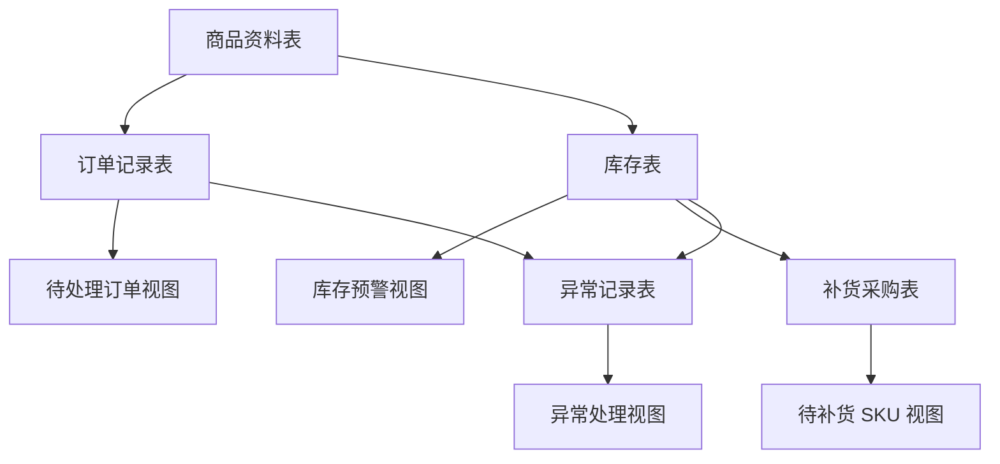

# 跨境电商 ERP 流程模拟工作台作品说明

## 作品名称

跨境电商 ERP 流程模拟工作台

英文名称：

Cross-Border E-Commerce ERP Workflow Simulation

## 作品定位

这个作品用于模拟跨境电商小卖家的商品、订单、库存、补货和异常处理流程。

它不是一个完整 ERP 系统，也不是自动化软件，而是一个基于飞书多维表格搭建的业务流程工作台。核心目标是展示对跨境电商数据对象、库存预警、补货判断和异常处理流程的理解。

本作品服务于 **AI 自动化工程师（跨境电商方向）求职**。当前阶段先用飞书多维表格复刻跨境电商业务流程，证明对商品、订单、库存、补货和异常处理的理解；后续将基于这些 mock 数据继续扩展 Python/Pandas 数据清洗、RPA 自动化和 AI 工作流能力。

当前阶段重点是：

- 用低成本工具搭建清晰流程
- 用 `SKU` 串联商品、订单、库存、补货和异常
- 用视图筛选出运营真正需要处理的问题
- 用公式字段减少重复判断和手动计算

## 解决的问题

跨境电商日常运营中，经常会遇到这些问题：

- 商品资料分散，SKU、产品名、供应商、成本信息不统一
- 订单状态需要人工逐条查看，难以及时发现待处理和异常订单
- 库存数量低于安全库存时，没有清晰预警
- 补货任务依赖人工判断，容易漏掉低库存或缺货 SKU
- 缺货、订单异常、商品资料缺失等问题没有统一跟踪入口

这个工作台用飞书多维表格把这些数据对象放到同一套流程里，帮助运营人员更快判断：

- 哪些订单需要处理
- 哪些 SKU 有库存风险
- 哪些商品需要补货
- 哪些异常还没有解决

## 核心流程



流程说明：

1. `商品资料表` 记录 SKU、产品名、类目、平台、供应商、成本和商品状态。
2. `订单记录表` 记录订单号、SKU、数量、销售额、平台、订单状态和订单日期。
3. `库存表` 记录当前库存、安全库存和库存状态。
4. `补货采购表` 根据库存状态和安全库存判断是否需要补货。
5. `异常记录表` 记录缺货异常、订单异常和商品资料缺失。
6. 顶部视图用于筛选真正需要处理的业务问题。

## 数据表说明

| 数据表 | 作用 |
|---|---|
| 商品资料表 | 定义商品基础信息，是 SKU 的主数据来源 |
| 订单记录表 | 记录订单状态，识别待处理和异常订单 |
| 库存表 | 记录当前库存、安全库存和库存状态 |
| 补货采购表 | 跟踪缺口数量、补货原因、系统建议和补货状态 |
| 异常记录表 | 统一记录缺货、订单异常、商品资料缺失等问题 |

## 关键字段设计

### SKU

`SKU` 是整个工作台的核心匹配字段。

每张表都有自己的 `SKU` 文本字段，但所有表使用同一套 SKU 编号。这样可以通过 `SKU` 把商品、订单、库存、补货和异常串联起来。

### 当前库存与安全库存

- `当前库存`：仓库现在实际还有多少件。
- `安全库存`：人为设定的最低库存底线。

当当前库存低于安全库存时，系统判断为低库存；当当前库存为 0 时，系统判断为缺货。

### 补货判断

`补货采购表` 中使用公式字段自动判断：

- `缺口数量`：当前库存低于安全库存时，自动计算差额。
- `补货原因`：根据库存状态生成原因说明。
- `系统建议`：根据库存状态生成暂不补货、建议补货或紧急补货。

人工字段保留：

- `补货状态`
- `负责人`
- `预计到货日期`
- `备注`

这样可以保持一个真实业务逻辑：

> 系统判断风险，人工确认动作。

## 关键视图说明

| 视图 | 数据来源 | 作用 |
|---|---|---|
| 库存预警视图 | 库存表 | 筛选低库存和缺货 SKU |
| 待补货 SKU 视图 | 补货采购表 | 筛选系统建议补货且未取消的补货任务 |
| 待处理订单视图 | 订单记录表 | 筛选待处理和异常订单 |
| 异常处理视图 | 异常记录表 | 筛选未处理完成的异常记录，并按异常类型分组 |

这些视图分别服务不同角色：

| 角色 | 主要查看内容 |
|---|---|
| 运营 | 待处理订单、异常处理视图 |
| 仓库 | 库存预警视图 |
| 采购 | 待补货 SKU 视图 |
| 运营主管 | 异常处理视图和整体流程状态 |

## 当前完成情况

已完成：

- 5 张基础数据表
- SKU 主线匹配逻辑
- 查找引用字段
- 补货采购表公式字段
- 补货状态单选字段
- 4 个关键视图
- 总览仪表盘
- 4 个核心数字卡片：待处理订单数量、库存预警 SKU 数量、待补货任务数量、待处理异常数量
- 4 个明细组件：待处理订单明细、库存预警明细、待补货任务明细、待处理异常明细
- mock CSV 数据目录
- AI 自动化工程师求职作品定位

4 个关键视图：

- 库存预警视图
- 待补货 SKU 视图
- 待处理订单视图
- 异常处理视图

## 当前限制

当前作品仍然是流程模拟，不包含以下能力：

- 不接入真实 ERP 系统
- 不接入平台 API
- 不做真实库存自动扣减
- 不做 RPA 自动点击
- 不做自动采购下单
- 不处理真实客户隐私数据

这些限制是有意保留的，因为当前目标是先证明对业务流程和表格结构的理解，而不是提前进入复杂自动化。

## 下一步优化

后续可以继续补充：

- 仪表盘优化：进一步收窄字段、统一组件高度，让展示更像真实运营后台
- 面试讲解：说明为什么先做 ERP 业务流程，再扩展自动化能力
- Python/Pandas：基于 `data/` 目录中的 mock CSV 做数据清洗和汇总
- RPA/低代码：基于飞书表格状态变化设计简单自动化流程
- AI 工作流：探索 Coze、LLM API 或飞书自动化在 Listing、异常摘要、补货建议中的应用
- 操作说明：说明客户如何使用这些视图处理日常运营问题
- JD 适配：把作品对应到招聘 JD 中的 ERP、库存、订单、报表、飞书多维表格、Python、RPA 和 AI 平台要求

## 面试讲解要点

可以这样解释这个作品：

```text
我先没有直接做复杂 AI 自动化，而是先复刻了跨境电商里最基础的业务流程：商品、订单、库存、补货和异常处理。
这个工作台用飞书多维表格实现，核心是用 SKU 串联数据，再用公式和视图筛选出待处理订单、库存预警、待补货任务和异常问题。
这样做的目的是先证明我理解业务对象和流程，再基于这些 mock CSV 数据继续扩展 Python/Pandas 数据清洗、RPA 自动化和 AI 工作流。
```
