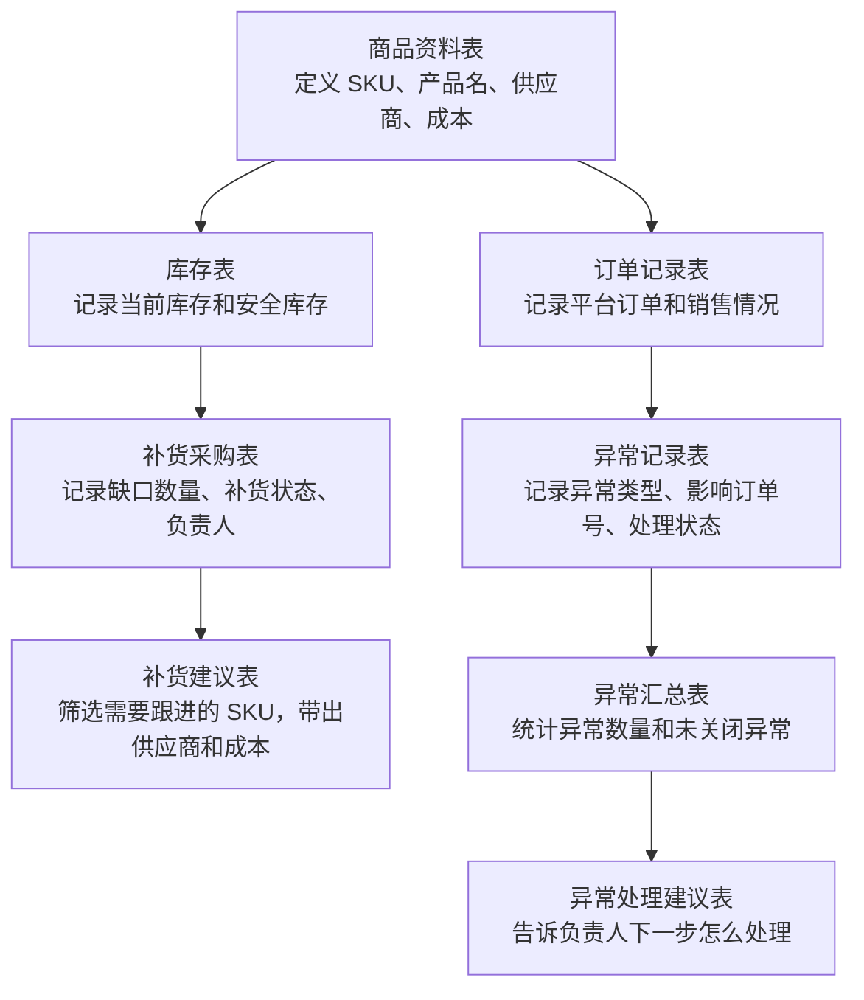
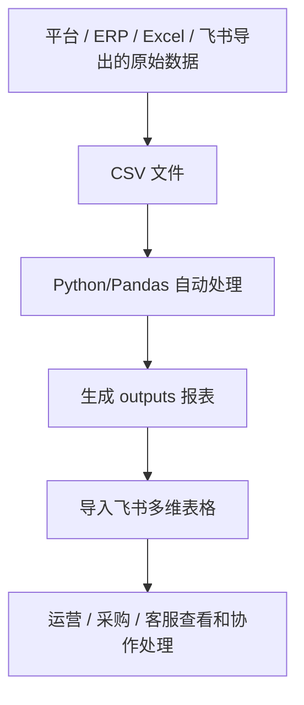

# 跨境电商 ERP 数据报表自动化业务需求复盘

## 1. 项目概述

这是一个围绕 **跨境电商 ERP 业务流程** 搭建的学习项目。

当前项目不是接入真实平台，也不是直接做完整系统，而是用 **mock CSV 数据** 模拟跨境电商中的商品、订单、库存、补货和异常处理流程，再用 Python/Pandas 自动生成业务报表。

项目目标：

```text
理解跨境电商 ERP 业务流程
↓
用飞书多维表格搭建业务工作台
↓
用 Python/Pandas 自动整理 CSV 数据
↓
生成订单、库存、补货、异常等业务报表
↓
沉淀为 AI 自动化工程师求职作品
```

一句话总结：

> 用 mock CSV 模拟跨境电商 ERP 数据，再用 Python 把订单、库存、补货、异常整理成运营 / 采购可以查看和跟进的报表。

## 2. 当前业务流程



## 3. 核心表说明

| 表 | 作用 | 关键字段 | 解决的问题 |
|---|---|---|---|
| 商品资料表 | 定义商品基础信息 | SKU、产品名、类目、供应商、成本、商品状态 | 这个 SKU 是什么商品，找谁采购，成本是多少 |
| 订单记录表 | 记录平台订单明细 | 订单号、SKU、数量、销售额、平台、订单状态 | 哪些商品卖出去了，在哪个平台卖的 |
| 库存表 | 记录库存情况 | SKU、当前库存、安全库存、库存状态 | 哪些商品低库存或缺货 |
| 补货采购表 | 记录补货任务 | SKU、缺口数量、系统建议、补货状态、负责人 | 哪些商品进入补货流程 |
| 补货建议表 | 给采购 / 运营看的补货报表 | SKU、缺口数量、供应商、成本、预计补货成本 | 哪些 SKU 要补、缺多少、找谁买、大概要花多少钱 |
| 异常记录表 | 记录业务异常 | 异常编号、SKU、异常类型、影响订单号、处理状态 | 哪些订单或商品出现异常 |
| 异常汇总表 | 汇总异常数量 | 异常类型、处理状态、数量 | 当前异常整体情况是否严重 |
| 异常处理建议表 | 给负责人看的处理清单 | 异常类型、影响订单号、负责人、处理建议 | 每条异常下一步应该怎么处理 |

## 4. 关键业务关系

### 4.1 SKU 的作用

SKU 是商品维度的连接字段。

它负责把这些表串起来：

```text
商品资料表
订单记录表
库存表
补货采购表
异常记录表
```

业务含义：

> SKU 用来回答“这是哪个商品”。

例如：

```text
SKU004 = 硅胶化妆刷清洁垫
```

### 4.2 影响订单号的作用

`影响订单号` 是异常记录表和订单记录表之间的连接字段。

关系是：

```text
异常记录表.影响订单号 = 订单记录表.订单号
```

业务含义：

> 影响订单号用来回答“这个异常影响了哪一笔订单”。

例如：

```text
EXC001 缺货异常
影响订单号 = ORD006
```

说明 `ORD006` 这笔订单因为异常需要继续处理。

## 5. Python 和飞书的关系

当前项目里，飞书和 Python 不是互相替代关系，而是分工不同。

| 工具 | 作用 |
|---|---|
| 飞书多维表格 | 搭建业务工作台，用于查看、筛选、协作、更新状态 |
| Python/Pandas | 自动读取 CSV，进行筛选、汇总、关联、计算，生成报表 |

推荐工作流：



简单说：

```text
Python 负责批量处理数据
飞书负责展示、协作和状态跟进
```

## 6. 关于 CSV 数据来源

当前项目里的 CSV 是 **mock 数据**，也就是模拟数据。

使用 mock 数据的原因：

- 避免使用真实客户数据和真实订单数据。
- 先练清楚业务流程和数据关系。
- 方便后续作为作品集展示。

真实工作里，CSV 数据可能来自：

- Amazon / Temu / Shopee / TikTok Shop 后台导出
- ERP 系统导出
- 仓库库存系统导出
- 采购 Excel 表
- 飞书多维表格导出

## 7. 生成的 CSV 如何进入飞书

当前阶段推荐使用手动导入，不做 API 自动同步。

流程：

```text
Python 生成 outputs/*.csv
↓
打开飞书多维表格
↓
新建数据表或进入已有数据表
↓
导入 CSV / 复制粘贴数据
↓
检查字段是否对应
↓
创建视图、筛选、分组、看板
```

说明：

- 第一次搭建时，可以新建飞书数据表再导入 CSV。
- 后续练习时，可以复制粘贴或导入到已有表。
- API 自动同步属于后续阶段，现在暂时不做。

## 8. 当前阶段边界

当前阶段优先做：

- 理解商品、订单、库存、补货、异常之间的业务关系。
- 用 Python/Pandas 生成可解释的业务报表。
- 用飞书承接报表展示和协作。
- 把整个流程整理成可面试讲解的作品。

当前阶段暂时不做：

- 不接真实平台 API。
- 不接真实 ERP。
- 不做 n8n / Make。
- 不做 RPA 自动点击。
- 不做完整 SaaS 系统。
- 不使用真实客户、订单、手机号、地址等敏感数据。

## 9. 我当前已经理解的内容

- 商品资料表是 SKU 的基础表。
- SKU 用来连接商品、订单、库存、补货和异常。
- 订单号 / 影响订单号用来连接异常和订单。
- 补货建议表不是原始表，而是从补货采购表和商品资料表整理出来的报表。
- 异常汇总表负责看整体异常数量。
- 未关闭异常清单负责查看具体异常。
- 异常处理建议表负责推动负责人处理异常。

## 10. 后续需要继续搞清楚的问题

- 如何把 Python 输出的报表包装成面试作品说明。
- 如何向面试官解释每张报表的业务价值。
- 什么时候需要用飞书，什么时候需要用 Python。
- 后续如果进入真实工作，如何从 ERP / 平台导出真实数据并替换 mock 数据。
- API、RPA、n8n / Make 是否有必要放到后续阶段。

