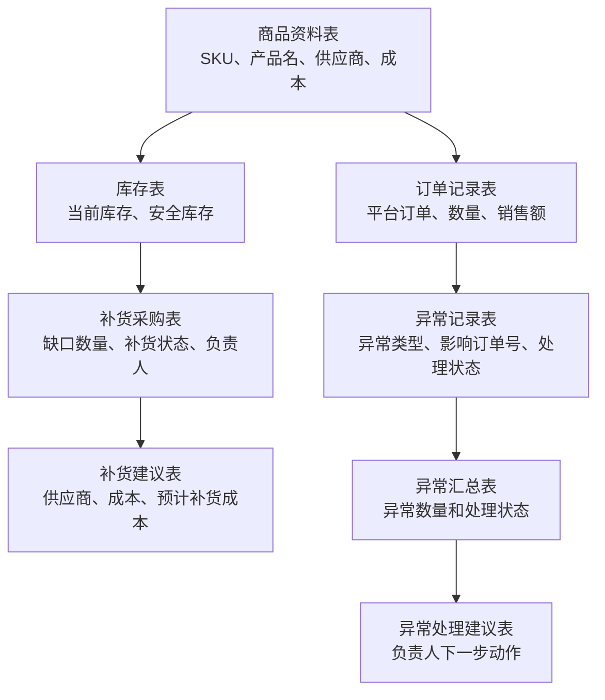
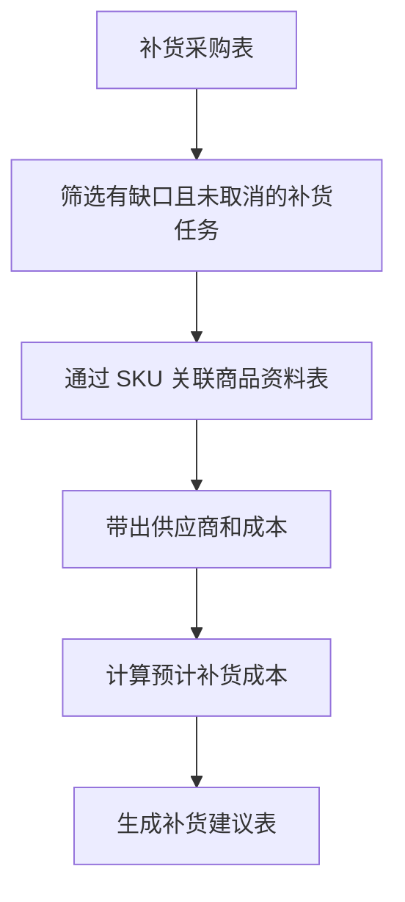
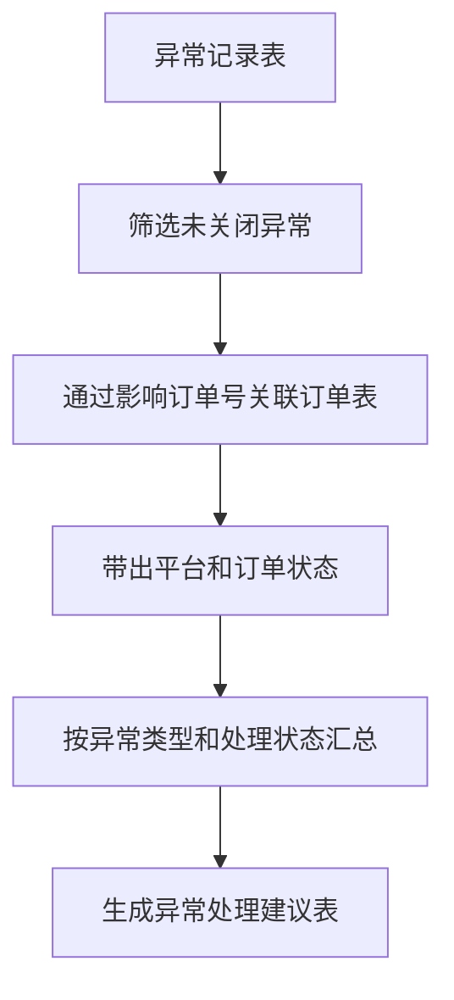
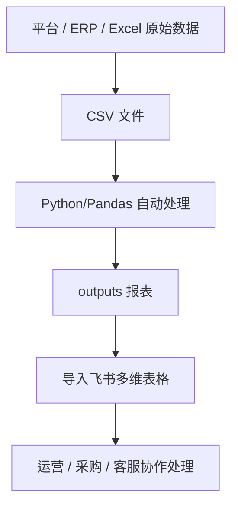

# 跨境电商 ERP 数据报表自动化项目作品说明

## 1. 项目简介

这是一个面向 **AI 自动化工程师 / 数据自动化助理** 方向的作品集项目。

项目使用 mock CSV 数据模拟跨境电商 ERP 场景中的商品、订单、库存、补货和异常处理流程，再使用 Python/Pandas 自动生成业务报表。

这个项目不是完整商业系统，也没有接入真实平台 API。当前阶段的重点是证明：

```text
我能理解业务表格流程
↓
我能把业务规则拆成数据处理步骤
↓
我能用 Python/Pandas 自动生成可查看、可协作、可解释的业务报表
```

## 2. 业务背景

跨境电商日常运营中，商品、订单、库存、补货和异常通常分散在不同表格或系统中。

如果全部人工处理，会遇到这些问题：

- SKU 是否一致需要人工核对。
- 订单销量和销售额需要手动汇总。
- 低库存和缺货 SKU 需要人工筛选。
- 补货任务需要在商品表和补货表之间来回查。
- 异常订单需要人工定位影响订单号和负责人。

本项目的目标是把这些重复表格工作整理成自动化报表。

## 3. 数据来源

当前项目使用的是 mock CSV 数据，位于 `data/` 目录。

| 文件 | 业务含义 |
|---|---|
| `products.csv` | 商品资料表 |
| `orders.csv` | 订单记录表 |
| `inventory.csv` | 库存表 |
| `replenishment.csv` | 补货采购表 |
| `exceptions.csv` | 异常记录表 |

真实工作中，这些 CSV 可能来自：

- Amazon / Temu / Shopee / TikTok Shop 后台导出
- ERP 系统导出
- 仓库库存系统导出
- 采购 Excel 表
- 飞书多维表格导出

## 4. 业务流程



## 5. Python 自动化处理内容

### 5.1 SKU 一致性检查

业务问题：

```text
订单、库存、补货、异常表里的 SKU，是否都能在商品资料表中找到？
```

业务价值：

- 防止订单、库存、补货和异常无法匹配商品。
- 确认商品资料表可以作为 SKU 主表。

### 5.2 订单汇总

业务问题：

```text
每个 SKU 卖了多少件？
每个平台贡献了多少订单和销售额？
哪些订单处于待处理或异常状态？
```

业务价值：

- 把订单明细整理成运营可看的销售汇总。
- 快速定位待处理 / 异常订单。

### 5.3 库存预警

业务问题：

```text
哪些 SKU 当前库存低于安全库存？
哪些 SKU 已经缺货？
```

业务价值：

- 提前发现低库存和缺货风险。
- 为补货任务提供依据。

### 5.4 补货建议

业务问题：

```text
哪些 SKU 需要补货？
缺多少？
找哪个供应商？
预计补货成本是多少？
```

业务流程：



业务价值：

- 采购 / 运营可以直接看到需要补货的 SKU。
- 不需要在补货表和商品表之间反复查找供应商和成本。

### 5.5 异常汇总

业务问题：

```text
有哪些异常还没处理？
这些异常影响了哪些订单？
负责人下一步应该做什么？
```

业务流程：



业务价值：

- 汇总表负责看整体风险。
- 未关闭异常清单负责处理具体问题。
- 处理建议表负责推动异常闭环。

## 6. 输出报表

| 报表 | 作用 |
|---|---|
| `sku_check_report.csv` | 检查 SKU 是否能匹配商品资料表 |
| `order_summary_by_sku.csv` | 按 SKU 汇总销量和销售额 |
| `order_summary_by_platform.csv` | 按平台汇总订单和销售额 |
| `pending_or_exception_orders.csv` | 筛选待处理 / 异常订单 |
| `inventory_alert_report.csv` | 输出低库存 / 缺货 SKU |
| `day5_replenishment_suggestion.csv` | 输出补货建议表 |
| `day6_exception_summary.csv` | 输出异常类型和处理状态汇总 |
| `day6_open_exceptions.csv` | 输出未关闭异常清单 |
| `day6_exception_action_suggestion.csv` | 输出异常处理建议 |

## 7. 飞书与 Python 的分工

| 工具 | 作用 |
|---|---|
| Python/Pandas | 批量读取 CSV，自动筛选、汇总、关联和计算 |
| 飞书多维表格 | 展示报表、筛选视图、协作处理、更新状态 |

推荐流程：



## 8. 项目价值

这个项目证明了以下能力：

- 能理解跨境电商 ERP 中的商品、订单、库存、补货和异常流程。
- 能把业务规则拆成数据处理步骤。
- 能使用 Python/Pandas 处理 CSV 数据。
- 能通过 SKU、订单号等关键字段关联多张表。
- 能把明细数据整理成可查看、可跟进的业务报表。
- 能把飞书表格流程和 Python 自动化报表结合起来。

## 9. 当前边界

当前项目暂时不做：

- 不接真实 ERP。
- 不接平台 API。
- 不做 n8n / Make。
- 不做 RPA 自动点击。
- 不做完整 SaaS 系统。
- 不使用真实客户数据和真实订单数据。

后续可以扩展：

- 使用真实导出的脱敏 CSV 替换 mock 数据。
- 将 Python 输出报表导入飞书形成看板。
- 在报表逻辑稳定后，再考虑 API、RPA 或低代码自动化。

