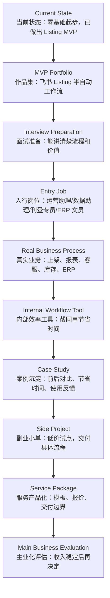
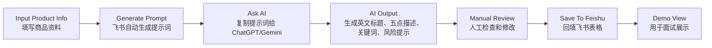
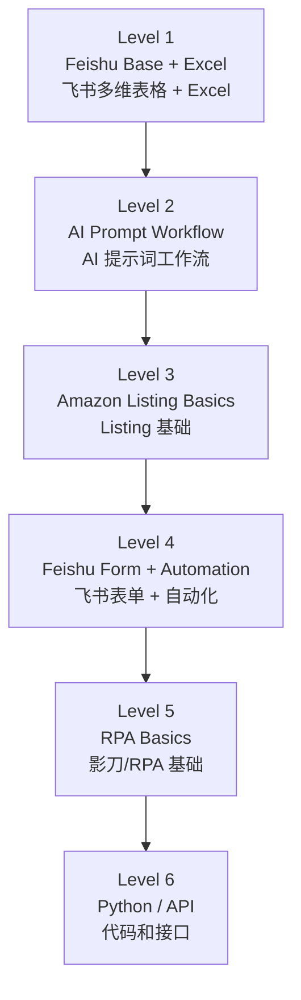
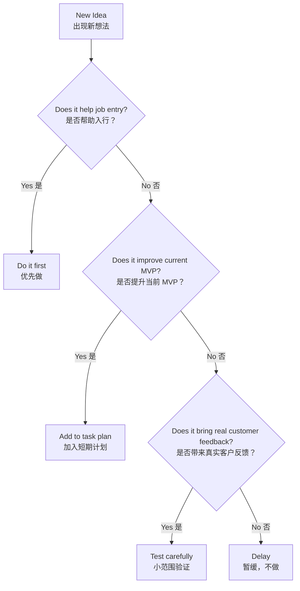

# Overall Roadmap: Cross-Border E-Commerce AI Workflow Career Plan

> 中文说明：这是你的长期总体计划文档。它不是一次写死的计划，而是后续会根据你的学习进度、求职情况、MVP 结果和真实市场反馈持续更新的主文档。  
> 使用方式：先看总体路线，再看具体阶段任务。短期计划放在独立文件里，例如 `02-7-day-learning-plan.md`。

## Current Position（当前位置）

你当前不是在做完整创业项目，而是在做一个更现实的过渡路线：

> 先进入跨境电商相关场景，理解业务流程，再用 AI、飞书多维表格、自动化工具做效率提升，最后逐步发展成副业或主业。

当前已经完成：

- Built a Feishu Base（已建立飞书多维表格）
- Created 6 product samples（已完成 6 条商品样本）
- Created a generated prompt formula（已完成“生成提示词”公式字段）
- Built a semi-automated Listing workflow MVP（已完成半自动 Listing 工作流 MVP）

当前阶段判断：

> 你已经从“想法阶段”进入“作品雏形阶段”。下一步不是盲目学更多工具，而是把这个 MVP 包装成可展示、可复盘、可面试表达的作品。

## Main Goal（总体目标）

长期目标：

- Build income ability（建立赚钱能力）
- Enter cross-border e-commerce industry（进入跨境电商行业）
- Build AI workflow capability（建立 AI 工作流能力）
- Turn side projects into real income（把副业项目变成真实收入）
- Clarify personal direction（逐步明确人生目标）

更现实的阶段性目标：

```text
0-3 个月：做出作品，理解基础业务，开始投递相关岗位
3-6 个月：进入跨境电商相关岗位或接近真实业务场景
6-12 个月：在真实业务里做出 1-2 个内部效率工具
12-18 个月：用真实案例尝试第一个外部小单
18-36 个月：积累客户、模板和行业经验，评估是否主业化
```

## Strategy（核心策略）

你的策略不是“马上创业”，而是：

1. Learn by building（通过做作品学习）
2. Enter the industry first（先进入行业）
3. Solve small workflow problems（先解决小流程问题）
4. Build reusable templates（沉淀可复用模板）
5. Convert internal cases into external services（把内部案例转成外部服务）

不建议当前立刻做：

- SaaS 产品
- 复杂代码系统
- Python 自动化大项目
- n8n / Make / API 集成
- AI 培训课程
- 高价企业咨询

原因：

> 你目前最缺的是行业场景、真实客户问题和可验证案例。技术可以慢慢补，但场景必须先靠近。

## Roadmap Flow（总体路线图）



## Current MVP（当前 MVP）

MVP 名称：

> Cross-Border Product Listing Semi-Automated Workflow  
> 跨境商品 Listing 半自动生成工作流

当前流程：



这个 MVP 的价值：

- 证明你能把重复工作拆成流程。
- 证明你能用表格承载业务数据。
- 证明你理解 AI 不是聊天，而是工作流的一部分。
- 可以作为求职作品展示。

当前不足：

- 还没有真实企业反馈。
- 还没有接入自动回填。
- 还没有真实平台运营经验。
- Listing 质量还需要通过真实 Amazon 页面学习校准。

## Job Direction（求职方向）

你优先找这些岗位：

- Cross-border e-commerce operation assistant（跨境电商运营助理）
- Listing assistant / Product listing specialist（商品刊登助理/专员）
- Operation data assistant（运营数据助理）
- ERP operation clerk（ERP 操作文员）
- Product information assistant（商品资料助理）
- Customer service quality review assistant（客服质检/售后流程支持）
- Supply chain / purchasing assistant（供应链/采购/跟单助理）

不建议一开始主攻：

- AI automation engineer（AI 自动化工程师）
- Machine learning engineer（机器学习工程师）
- Full-stack developer（全栈开发）
- Senior Amazon operator（高级 Amazon 运营）

原因：

> 这些岗位对技术、经验或业务理解要求更高。你现在更适合先拿到业务入口，再用自动化能力形成差异化。

## Skill Path（技能路线）

技能优先级：



当前只重点学习：

- Feishu Base（飞书多维表格）
- Views（视图）
- Form（表单）
- Automation（自动化）
- Amazon Listing structure（Amazon Listing 结构）
- Risk words（风险词）

暂时不学：

- Python
- n8n
- Make
- API
- SaaS

## Decision Rules（决策规则）

当你不知道下一步该做什么时，用这个判断：



简单说：

> 不能帮助入行、不能提升 MVP、不能带来真实反馈的事情，先不做。

## 30-Day Direction（三十天方向）

未来 30 天只做三件事：

1. Polish the MVP（打磨当前 MVP）
   - 整理视图
   - 添加表单
   - 添加状态流转
   - 做好面试展示视图

2. Learn Amazon Listing basics（学习 Listing 基础）
   - 看 10-20 个真实 Amazon 页面
   - 记录标题结构、五点描述、风险词
   - 优化你的提示词模板

3. Prepare for job entry（准备入行）
   - 整理求职介绍
   - 准备作品展示话术
   - 收集广州/番禺/白云/海珠相关岗位
   - 每周复盘岗位需求

## Review Schedule（复盘节奏）

每周复盘一次：

- What did I finish?（我完成了什么？）
- What did I learn?（我学到了什么？）
- What blocked me?（我卡在哪里？）
- What should I do next week?（下周做什么？）

每月更新一次总体计划：

- 是否继续当前方向？
- 是否需要调整求职岗位？
- MVP 是否需要升级？
- 是否出现真实业务机会？
- 是否应该开始接触企业或招聘者？

## Update Log（更新记录）

### 2026-06-06

- Created this overall roadmap.
- Confirmed current direction:
  - Build MVP first.
  - Learn Feishu workflow and Amazon Listing basics.
  - Use the MVP as an entry-level portfolio.
  - Avoid over-learning technical tools too early.
