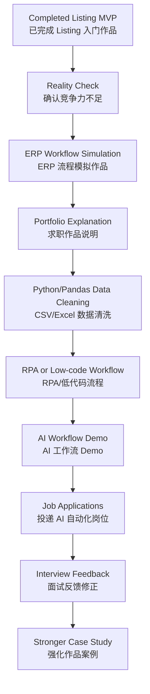
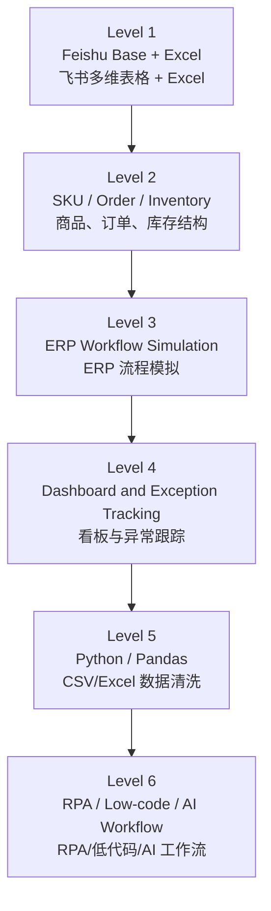
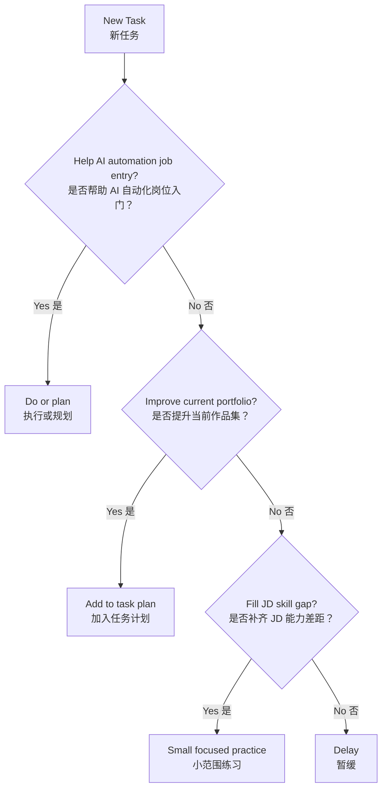

# Overall Roadmap: Cross-Border E-Commerce AI Automation Engineer Portfolio

> 中文说明：这是长期总体计划文档。它会根据学习进度、作品质量、招聘 JD 和真实市场反馈持续更新。  
> 当前关键判断：最终目标是应聘跨境电商方向的 AI 自动化工程师。Listing 半自动工作流只是入门练习；ERP/飞书流程作品用于证明业务理解，后续必须继续补齐 Python/Pandas、RPA、低代码平台和 AI 工作流能力。

## Current Position（当前位置）

当前已经完成：

- [x] Built a Feishu Base（已建立飞书多维表格）
- [x] Built a Listing prompt workflow（已完成 Listing 提示词工作流）
- [x] Created workflow views and form（已完成视图、表单、基础状态流程）
- [x] Completed `02-3-day-feishu-workflow-practice.md`
- [x] Completed ERP workflow simulation Day 1-Day 4（已完成 ERP 流程模拟 Day 1-Day 4）
- [x] Created mock CSV data under `data/`（已建立 mock CSV 数据目录）

当前重新判断：

> 飞书 Listing 工作流能证明学习能力和流程意识，但不足以支撑 AI 自动化工程师求职。下一步必须围绕真实跨境电商业务对象建立作品链：ERP 流程模拟 -> CSV/Excel 数据清洗 -> RPA/低代码流程 -> AI 工作流。

## Main Goal（总体目标）

长期目标：

- [ ] Build AI automation engineer portfolio（建立 AI 自动化工程师作品集）
- [ ] Understand real cross-border operations（理解真实跨境电商业务）
- [ ] Build ERP/data workflow capability（建立 ERP/数据流程能力）
- [ ] Build Python/Pandas data cleaning capability（建立 Python/Pandas 数据清洗能力）
- [ ] Build RPA/low-code/AI workflow capability（建立 RPA、低代码和 AI 工作流能力）
- [ ] Prepare job-ready case explanations（准备可用于面试讲解的作品案例）

阶段目标：

```text
0-1 个月：做出 ERP 流程模拟作品，完成 AI 自动化岗位 JD 反推分析
1-2 个月：基于 mock CSV 做 Python/Pandas 数据清洗作品
2-3 个月：补充飞书自动化、RPA 或 Coze 工作流 Demo
3-6 个月：开始投递 AI 自动化工程师、AI 应用助理、RPA/数据自动化相关岗位
6-12 个月：沉淀 1-2 个更完整的业务自动化案例
```

## Strategy（核心策略）

当前策略：

- [x] Learn by building（通过做作品学习）
- [x] Build ERP workflow simulation Day 1-Day 4（已完成 ERP 流程模拟 Day 1-Day 4）
- [ ] Package ERP workflow as job portfolio（把 ERP 工作台整理成求职作品）
- [ ] Build Python/Pandas mock data cleaning demo（制作 Python/Pandas mock 数据清洗作品）
- [ ] Build RPA/low-code/AI workflow demo（制作 RPA/低代码/AI 工作流 Demo）
- [ ] Analyze AI automation engineer JD gaps（持续分析 AI 自动化工程师 JD 能力差距）

不再采用的策略：

- 不把 Listing MVP 当作核心竞争力。
- 不先包装面试话术来掩盖能力不足。
- 不直接卖“AI自动化”这种大而空的服务。
- 不脱离业务流程空学 Python、API、n8n、Make。

## Roadmap Flow（总体路线图）



## Current Portfolio（当前作品定位）

### 已完成：Listing 半自动工作流

定位：

> 入门练习作品，用来证明飞书基础、字段意识、流程意识和 AI 提示词工作流理解。

不再包装为：

> 能直接带来就业竞争力的核心作品。

### 当前核心作品：Cross-Border ERP Workflow Simulation

中文名称：

> 跨境电商 ERP 流程模拟工作台

核心流程：

```text
商品资料 -> 订单记录 -> 库存变化 -> 库存预警 -> 补货任务 -> 异常处理 -> 状态跟踪
```

最小模块：

- 商品资料表
- 订单记录表
- 库存表
- 补货/采购表
- 异常记录表
- 库存预警/待处理/待补货/异常处理视图

### 下一作品：CSV/Excel 数据清洗 Demo

目标：

> 基于 `data/` 目录中的 mock CSV 数据，练习 Python/Pandas，把飞书表格里的业务数据转化成可清洗、可汇总、可检查的数据处理作品。

## Job Direction（岗位方向）

优先岗位：

- AI 自动化工程师（跨境电商）
- AI 应用工程师 / AI 应用助理
- RPA 自动化工程师助理
- 低代码/飞书多维表格流程搭建
- 数据自动化 / 数据处理助理
- 跨境电商 ERP/运营数据支持

辅助验证服务：

> 跨境电商商品/订单/库存表格整理服务可以作为低门槛真实需求验证，但不是当前主线。当前主线是求职作品集。

## Skill Path（技能路线）



当前重点学习：

- SKU、订单、库存、补货这些基础业务对象
- 飞书多维表格关系、视图、表单、状态字段
- Excel/CSV 表格清洗思维
- JD 痛点分析
- ERP 作品的面试讲解能力

下一阶段开始学习：

- Python 基础
- Pandas 数据清洗
- CSV/Excel 数据汇总
- 飞书自动化、影刀 RPA、Coze 工作流

暂时不做：

- 脱离业务场景的 Python
- 脱离作品集的 API
- 脱离跨境电商流程的 n8n / Make
- SaaS
- 高价自动化交付

## Decision Rules（决策规则）



## 30-Day Direction（三十天方向）

1. [x] Build ERP workflow simulation Day 1-Day 4（完成 ERP 流程模拟 Day 1-Day 4）
   - 商品资料、订单、库存、补货、异常、关键视图

2. [ ] Finish Day 5 portfolio packaging（完成 Day 5 求职作品包装）
   - 作品说明、总览看板、面试讲解话术

3. [ ] Analyze 20 AI automation job descriptions（分析 20 条 AI 自动化岗位 JD）
   - 记录 ERP、库存、订单、商品资料、报表、飞书/Excel、Python、RPA、AI 平台要求

4. [ ] Build Python/Pandas mock data cleaning demo（制作 Python/Pandas mock 数据清洗作品）
   - 使用 `data/` 目录中的 CSV 样本

## Review Schedule（复盘节奏）

每周复盘一次：

- [ ] 本周是否推进 AI 自动化求职作品集？
- [ ] 是否新增 JD 反推记录？
- [ ] 是否更清楚 AI 自动化工程师岗位需要什么？
- [ ] 是否把作品转化成可面试讲解的案例？

每月更新一次：

- [ ] 是否继续跨境电商 AI 自动化方向？
- [ ] 是否需要开始投递岗位？
- [ ] 是否需要补 Python/Pandas/RPA/Coze？
- [ ] 是否需要新增计划文档？

## Update Log（更新记录）

### 2026-06-06

- Created the initial overall roadmap.

### 2026-06-07

- Completed `02-3-day-feishu-workflow-practice.md`.
- Repositioned Listing workflow as an entry-level practice project.
- Changed strategy to ERP/data workflow support and table cleanup service validation.

### 2026-06-08

- Clarified the final goal as AI automation engineer job entry.
- Repositioned ERP workflow simulation as the first job portfolio project.
- Added Python/Pandas, RPA/low-code, and AI workflow as the next capability layers.
