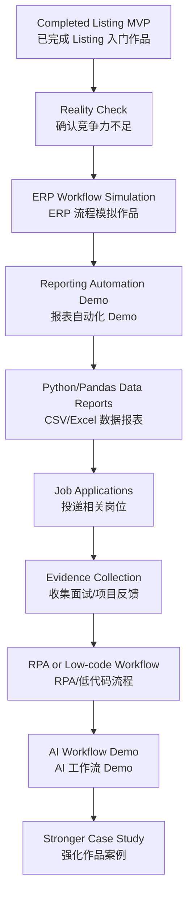
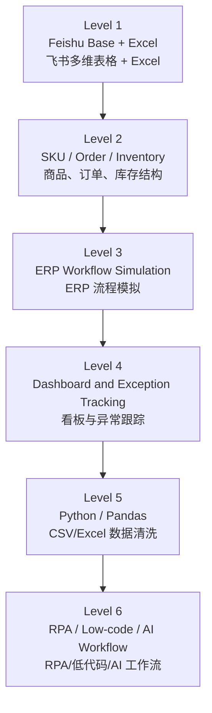
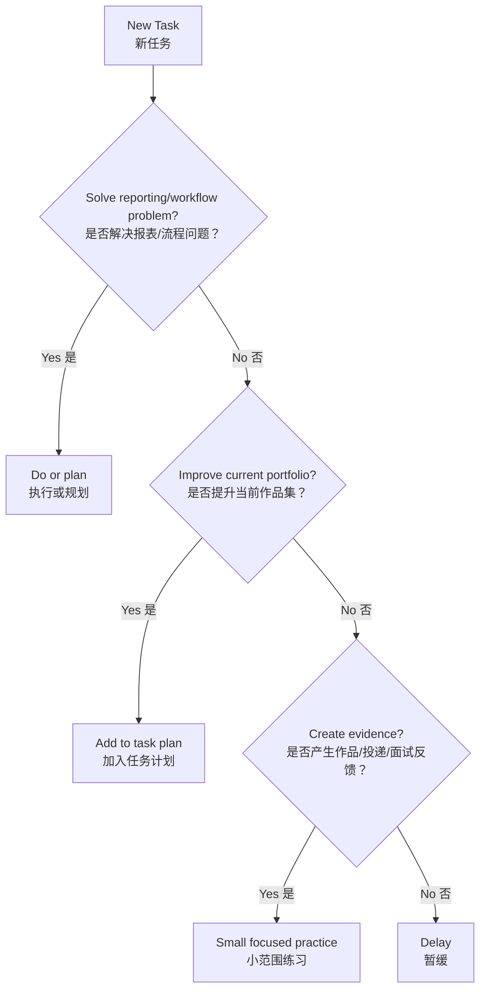

# Overall Roadmap: Data Reporting Automation Portfolio

> 中文说明：这是长期总体计划文档。它会根据学习进度、作品质量、招聘 JD 和真实市场反馈持续更新。  
> 当前关键判断：最适合当前阶段的主线不是泛泛的“AI 自动化”，而是 **数据报表自动化**。电商 / ERP / 库存管理是练习场景，AI 自动化工程师是岗位包装，核心能力是用工具、数据和自动化把业务报表和流程变得更简单。

## Current Position（当前位置）

当前已经完成：

- [x] Built a Feishu Base（已建立飞书多维表格）
- [x] Built a Listing prompt workflow（已完成 Listing 提示词工作流）
- [x] Created workflow views and form（已完成视图、表单、基础状态流程）
- [x] Completed `02-3-day-feishu-workflow-practice.md`
- [x] Completed ERP workflow simulation Day 1-Day 4（已完成 ERP 流程模拟 Day 1-Day 4）
- [x] Created mock CSV data under `data/`（已建立 mock CSV 数据目录）

当前重新判断：

> 飞书 Listing 工作流能证明学习能力和流程意识，但不足以支撑求职。下一步不是继续选方向，而是验证一个具体问题：能不能把电商订单 / 库存数据，自动整理成老板能看的报表。

## Main Goal（总体目标）

长期目标：

- [ ] Build data reporting automation portfolio（建立数据报表自动化作品集）
- [ ] Understand real cross-border operations（理解真实跨境电商业务）
- [ ] Build ERP/data workflow capability（建立 ERP/数据流程能力）
- [ ] Build Python/Pandas data cleaning capability（建立 Python/Pandas 数据清洗能力）
- [ ] Build RPA/low-code/AI workflow capability after reporting logic is stable（报表逻辑稳定后建立 RPA、低代码和 AI 工作流能力）
- [ ] Prepare job-ready case explanations（准备可用于面试讲解的作品案例）

阶段目标：

```text
0-1 个月：完成 ERP/Pandas 数据处理 Demo，解决低库存、订单汇总、补货建议、异常清单问题
1-2 个月：投递 20-30 个相关岗位，重点是 AI 应用助理、数据处理助理、ERP 支持、自动化助理
2-3 个月：参与真实业务项目或模拟真实客户场景，收集反馈证据
3-6 个月：用 Python/RPA/飞书/AI 工具优化企业流程
6 个月后：把流程优化、报表自动化和自动化案例整理成可展示作品集
```

## Strategy（核心策略）

当前策略：

- [x] Learn by building（通过做作品学习）
- [x] Build ERP workflow simulation Day 1-Day 4（已完成 ERP 流程模拟 Day 1-Day 4）
- [ ] Package ERP workflow as reporting automation foundation（把 ERP 工作台整理成报表自动化基础作品）
- [ ] Build Python/Pandas mock data reporting demo（制作 Python/Pandas mock 数据报表作品）
- [ ] Generate job-ready reports: order summary, inventory alert, replenishment list, exception list（生成可讲解的订单、库存、补货、异常报表）
- [ ] Analyze job feedback and real requirements（用投递、面试和真实沟通反馈修正路线）

不再采用的策略：

- 不把 Listing MVP 当作核心竞争力。
- 不先包装面试话术来掩盖能力不足。
- 不直接卖“AI自动化”这种大而空的服务。
- 不脱离业务流程空学 Python、API、n8n、Make。

## Roadmap Flow（总体路线图）



## Current Portfolio（当前作品定位）

### 已完成：Listing 半自动工作流

定位：

> 入门练习作品，用来证明飞书基础、字段意识、流程意识和 AI 提示词工作流理解。

不再包装为：

> 能直接带来就业竞争力的核心作品。

### 当前核心作品：Cross-Border ERP Workflow Simulation

中文名称：

> 跨境电商 ERP 流程模拟工作台

核心流程：

```text
商品资料 -> 订单记录 -> 库存变化 -> 库存预警 -> 补货任务 -> 异常处理 -> 状态跟踪
```

最小模块：

- 商品资料表
- 订单记录表
- 库存表
- 补货/采购表
- 异常记录表
- 库存预警/待处理/待补货/异常处理视图

### 当前主线作品：CSV/Excel 数据报表自动化 Demo

目标：

> 基于 `data/` 目录中的 mock CSV 数据，练习 Python/Pandas，把飞书表格里的业务数据转化成老板能看的订单汇总、库存预警、待补货清单和异常订单清单。

## Job Direction（岗位方向）

优先岗位：

- AI 自动化工程师（跨境电商）
- AI 应用工程师 / AI 应用助理
- RPA 自动化工程师助理
- 低代码/飞书多维表格流程搭建
- 数据自动化 / 数据处理助理
- 跨境电商 ERP/运营数据支持
- 数据报表自动化 / 报表优化相关岗位

辅助验证服务：

> 跨境电商商品/订单/库存表格整理服务可以作为低门槛真实需求验证，但不是当前主线。当前主线是数据报表自动化作品和岗位验证。

## Skill Path（技能路线）



当前重点学习：

- SKU、订单、库存、补货这些基础业务对象
- 飞书多维表格关系、视图、表单、状态字段
- Excel/CSV 表格清洗思维
- JD 痛点分析
- ERP 作品的面试讲解能力
- 把原始数据转化成业务报表的能力

当前正在学习：

- Python 基础
- Pandas 数据清洗
- CSV/Excel 数据汇总

下一阶段再学习：

- 飞书自动化、影刀 RPA、Coze 工作流

暂时不做：

- 脱离业务场景的 Python
- 脱离作品集的 API
- 脱离跨境电商流程的 n8n / Make
- SaaS
- 高价自动化交付

## Decision Rules（决策规则）



## 30-Day Direction（三十天方向）

1. [x] Build ERP workflow simulation Day 1-Day 4（完成 ERP 流程模拟 Day 1-Day 4）
   - 商品资料、订单、库存、补货、异常、关键视图

2. [ ] Finish Day 5 portfolio packaging（完成 Day 5 求职作品包装）
   - 作品说明、总览看板、面试讲解话术

3. [ ] Finish Python/Pandas reporting demo（完成 Python/Pandas 报表自动化 Demo）
   - 输出订单汇总、库存预警、待补货清单、异常订单清单、自动日报/周报雏形

4. [ ] Apply to 20-30 related jobs（投递 20-30 个相关岗位）
   - AI 应用助理、数据处理助理、ERP 支持、自动化助理、数据报表自动化岗位

## Review Schedule（复盘节奏）

每周复盘一次：

- [ ] 本周是否推进数据报表自动化作品？
- [ ] 是否新增 JD 反推记录？
- [ ] 是否更清楚真实岗位需要什么报表/流程能力？
- [ ] 是否把作品转化成可面试讲解的案例？

每月更新一次：

- [ ] 是否继续数据报表自动化方向？
- [ ] 是否需要开始投递岗位？
- [ ] 是否需要补 Python/Pandas/RPA/Coze？
- [ ] 是否需要新增计划文档？

## Update Log（更新记录）

### 2026-06-06

- Created the initial overall roadmap.

### 2026-06-07

- Completed `02-3-day-feishu-workflow-practice.md`.
- Repositioned Listing workflow as an entry-level practice project.
- Changed strategy to ERP/data workflow support and table cleanup service validation.

### 2026-06-08

- Clarified the final goal as AI automation engineer job entry.
- Repositioned ERP workflow simulation as the first job portfolio project.
- Added Python/Pandas, RPA/low-code, and AI workflow as the next capability layers.

### 2026-06-09

- Based on `docs/我的天赋.md` and `docs/个人规划.md`, refined the main direction from broad AI automation to data reporting automation.
- Repositioned e-commerce / ERP as the practice scenario, not the final identity.
- Clarified the 30-day validation goal: turn e-commerce order and inventory CSV data into useful business reports.
