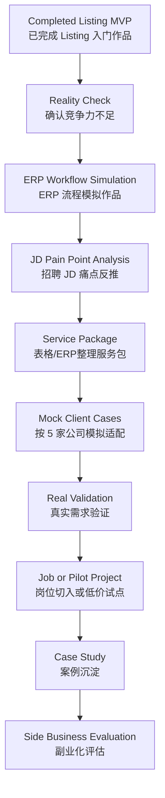
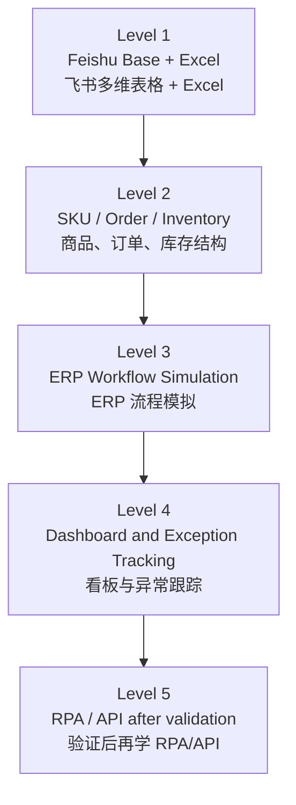
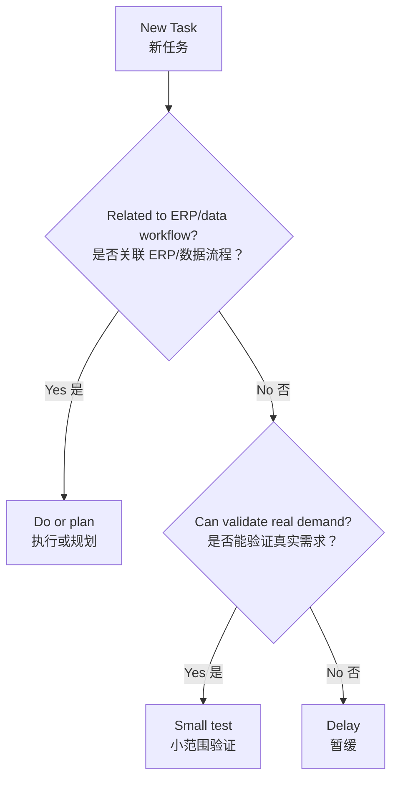

# Overall Roadmap: Cross-Border E-Commerce ERP/Data Workflow Plan

> 中文说明：这是长期总体计划文档。它会根据学习进度、作品质量、招聘 JD 和真实市场反馈持续更新。  
> 当前关键判断：Listing 半自动工作流只是入门练习，不能作为就业或副业竞争力核心。下一阶段转向更接近真实岗位和付费需求的 ERP/表格流程支持。

## Current Position（当前位置）

当前已经完成：

- [x] Built a Feishu Base（已建立飞书多维表格）
- [x] Built a Listing prompt workflow（已完成 Listing 提示词工作流）
- [x] Created workflow views and form（已完成视图、表单、基础状态流程）
- [x] Completed `02-3-day-feishu-workflow-practice.md`

当前重新判断：

> 飞书 Listing 工作流能证明学习能力和流程意识，但不足以支撑找工作或接副业单。下一步必须转向更硬的业务对象：商品、订单、库存、补货、异常、报表。

## Main Goal（总体目标）

长期目标：

- [ ] Build ERP/data workflow capability（建立 ERP/数据流程能力）
- [ ] Understand real cross-border operations（理解真实跨境电商业务）
- [ ] Validate table/ERP organization service（验证表格/ERP整理服务）
- [ ] Build income ability through practical services（用实用服务建立赚钱能力）
- [ ] Decide whether this can become a side business or main business（评估副业/主业化可能）

阶段目标：

```text
0-1 个月：做出 ERP 流程模拟作品，完成 JD 反推分析
1-3 个月：验证表格/ERP整理服务包，接触真实公司需求
3-6 个月：进入数据/ERP/运营支持岗位，或拿到第一个低价试点
6-12 个月：沉淀 1-2 个真实案例，形成可复用模板
12 个月后：评估是否扩大为稳定副业服务
```

## Strategy（核心策略）

当前策略：

- [x] Learn by building（通过做作品学习）
- [ ] Build ERP workflow simulation（搭建 ERP 流程模拟作品）
- [ ] Analyze JD pain points（从招聘 JD 反推企业痛点）
- [ ] Package a table/ERP cleanup service（包装表格/ERP整理服务）
- [ ] Test demand before selling automation（先验证需求，再谈自动化）

不再采用的策略：

- 不把 Listing MVP 当作核心竞争力。
- 不先包装面试话术来掩盖能力不足。
- 不直接卖“AI自动化”这种大而空的服务。
- 不马上学 Python、API、n8n、Make。

## Roadmap Flow（总体路线图）



## Current Portfolio（当前作品定位）

### 已完成：Listing 半自动工作流

定位：

> 入门练习作品，用来证明飞书基础、字段意识、流程意识和 AI 提示词工作流理解。

不再包装为：

> 能直接带来就业竞争力的核心作品。

### 下一作品：Cross-Border ERP Workflow Simulation

中文名称：

> 跨境电商 ERP 流程模拟工作台

核心流程：

```text
商品资料 -> 订单记录 -> 库存变化 -> 库存预警 -> 补货任务 -> 状态跟踪
```

最小模块：

- 商品资料表
- 订单记录表
- 库存表
- 补货/采购表
- 异常记录表
- 库存预警/待处理看板

## Job and Service Direction（岗位与服务方向）

优先岗位：

- 数据/ERP 文员
- 运营数据助理
- 商品资料/订单库存支持
- ERP 操作助理
- 运营流程支持
- 跨境电商运营助理

副业验证服务：

> 跨境电商商品/订单/库存表格整理服务

第一版服务包：

- 整理商品 SKU 表
- 整理订单/库存 Excel
- 建立飞书多维表格
- 设置基础状态字段
- 做 2-3 个视图：待处理、库存预警、已完成
- 输出简单操作说明

## Skill Path（技能路线）



当前只重点学习：

- SKU、订单、库存、补货这些基础业务对象
- 飞书多维表格关系、视图、表单、状态字段
- Excel/表格清洗思维
- JD 痛点分析

暂时不学：

- Python
- API
- n8n / Make
- SaaS
- 高价自动化交付

## Decision Rules（决策规则）



## 30-Day Direction（三十天方向）

1. [ ] Build ERP workflow simulation（搭建 ERP 流程模拟作品）
   - 商品资料、订单、库存、补货、异常、看板

2. [ ] Analyze 20 job descriptions（分析 20 条招聘 JD）
   - 记录 ERP、库存、订单、商品资料、报表、飞书/Excel 要求

3. [ ] Package table/ERP cleanup service（整理表格/ERP服务包）
   - 形成 1 页服务说明和 5 个模拟客户适配案例

## Review Schedule（复盘节奏）

每周复盘一次：

- [ ] 本周是否推进 ERP 流程作品？
- [ ] 是否新增 JD 反推记录？
- [ ] 是否更清楚真实岗位需要什么？
- [ ] 是否出现可以验证服务的真实机会？

每月更新一次：

- [ ] 是否继续 ERP/数据支持方向？
- [ ] 是否需要开始投递岗位？
- [ ] 是否可以接触真实小卖家？
- [ ] 是否需要学习新工具？

## Update Log（更新记录）

### 2026-06-06

- Created the initial overall roadmap.

### 2026-06-07

- Completed `02-3-day-feishu-workflow-practice.md`.
- Repositioned Listing workflow as an entry-level practice project.
- Changed strategy to ERP/data workflow support and table cleanup service validation.
