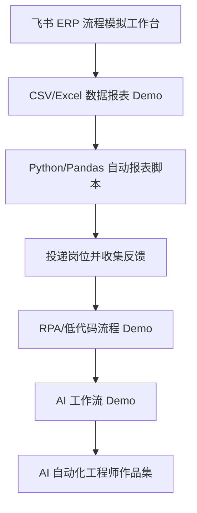

# Data Reporting Automation to AI Automation Roadmap（数据报表自动化到 AI 自动化能力路线）

> 中文说明：这份路线图用于衔接已经完成的飞书 ERP 流程模拟作品，规划后续 Python/Pandas、RPA/低代码和 AI 工作流学习。  
> 当前主线：数据报表自动化。最终目标是通过真实问题驱动的作品，进入 AI 自动化工程师、数据自动化助理、ERP 支持或 AI 应用助理等相关岗位。

## Goal（目标）

把当前飞书 ERP 流程模拟工作台升级成一套数据报表自动化作品链，再逐步扩展到 AI 自动化工程师求职作品集。

作品链顺序：

## Current Foundation（当前基础）

已完成：

- Listing 入门工作流
- 飞书多维表格基础练习
- 跨境电商 ERP 流程模拟 Day 1-Day 5
- 商品、订单、库存、补货、异常 5 张表
- 库存预警、待补货、待处理订单、异常处理 4 个关键视图
- ERP 工作台总览仪表盘
- `data/` mock CSV 数据目录

当前能力证明：

- 理解 SKU、订单、库存、安全库存、补货和异常处理
- 能用飞书多维表格搭建业务流程
- 能用公式字段和视图做基础自动判断
- 能从 JD 反推真实岗位痛点

## Stage 1：作品包装（已完成）

目标：

- 完成 ERP 工作台作品说明
- 完成总览看板
- 写出面试讲解话术
- 明确该作品如何服务 AI 自动化工程师求职

输出：

- `docs/erp-workflow-portfolio.md`
- ERP 工作台总览视图
- 面试讲解 3-5 分钟版本

## Stage 2：Python/Pandas 数据报表自动化（当前）

目标：

基于 `data/` 目录中的 CSV 文件，练习真实岗位中常见的数据报表任务。

练习内容：

- 读取商品、订单、库存、补货、异常 CSV
- 检查 SKU 是否一致
- 汇总订单数量和销售额
- 找出低库存和缺货 SKU
- 生成待补货清单
- 输出异常订单清单
- 形成日报/周报雏形

输出：

- Python/Pandas 自动报表脚本
- 订单汇总、库存预警、待补货、异常清单等输出报表
- 一段说明：这些报表解决什么业务问题

当前计划：

- `task-plans/05-python-pandas-data-cleaning-plan.md`

当前主脚本：

- `scripts/erp_data_cleaning_demo.py`

## Stage 3：岗位验证与真实反馈

目标：

不要继续只收集想法，而是开始收集证据。

行动：

- 投递 AI 应用助理、数据处理助理、ERP 支持、自动化助理等岗位
- 和真实从业者沟通岗位需求
- 根据面试反馈修正作品说明和技能路线
- 记录哪些能力真的被问到，哪些只是想象中的焦虑

输出：

- JD 反推记录
- 面试/沟通反馈记录
- 下一轮作品优化清单

## Stage 4：RPA / 低代码流程

目标：

把表格流程中的重复动作转化为可演示的自动化流程。

候选方向：

- 飞书自动化：状态变化后提醒负责人
- 影刀 RPA：模拟从网页/表格复制订单数据
- Coze 工作流：根据异常描述生成处理建议

输出：

- 1 个小型自动化 Demo
- 不追求全链路自动化，只证明能把业务动作拆成流程

## Stage 5：AI 工作流

目标：

在业务流程清楚后，再引入 AI 能力。

候选方向：

- Listing 文案生成
- 异常描述摘要
- 补货原因解释
- 订单异常处理建议
- JD 关键词提取和岗位能力分析

输出：

- 1 个 AI 工作流 Demo
- 说明输入、处理、输出和人工确认环节

## Job Matching（岗位匹配）

目标岗位常见要求：

- 跨境电商业务理解
- 飞书多维表格 / Airtable
- Python 数据处理
- Pandas / NumPy
- SQL 或数据库基础
- RPA 或低代码平台
- Coze / Agent / LLM API
- 沟通表达和跨团队协作

当前优先补齐顺序：

1. ERP/业务流程理解
2. CSV/Excel 数据报表
3. Python/Pandas 自动报表
4. 投递/面试/真实反馈
5. RPA/低代码
6. AI 工作流
7. SQL/数据库基础

## Do Not Do Yet（暂时不要做）

- 不直接做大型 AI Agent
- 不直接做 SaaS
- 不直接承诺全链路自动化
- 不脱离报表/流程问题空学技术
- 不把副业服务作为当前主线

原因：

> 当前主线是数据报表自动化。所有学习和作品都要服务“解决真实报表/流程问题，并产生可验证作品”这个目标。
