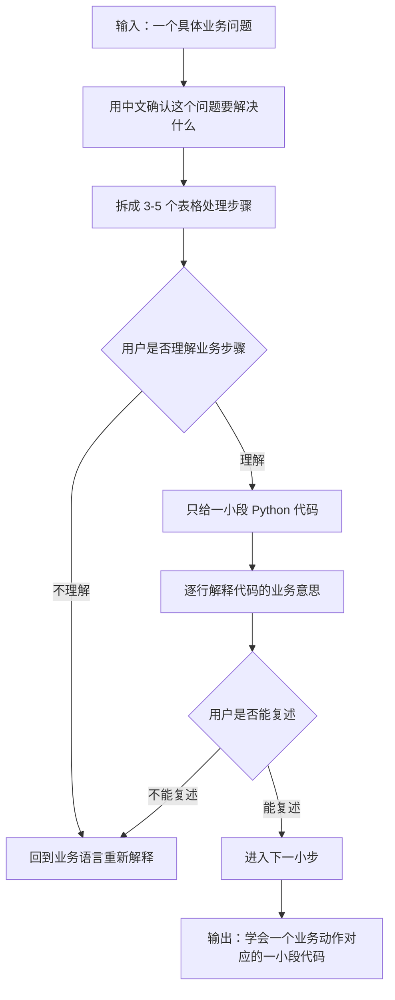

# 7-Day Plan: Python Pandas Reporting Automation Demo

> 中文说明：这份计划用于把已经完成的飞书 ERP 流程模拟工作台，升级为 Python/Pandas 数据报表自动化作品。  
> 每天投入：约 2-4 小时。  
> 工具限制：本阶段只使用 Python/Pandas 和本地 CSV，不做 API、RPA、n8n、Make 或真实平台接入。  
> 目标：用代码把订单、库存、补货和异常数据整理成老板能看的报表，形成数据报表自动化主线作品。

## Goal（目标）

Build a Python/Pandas reporting automation demo based on cross-border e-commerce ERP mock CSV data.

中文解释：基于 `data/` 目录中的模拟数据，完成 SKU 检查、订单汇总、库存预警、补货建议、异常清单和日报/周报雏形。

完成后应具备：

- Python/Pandas 主脚本
- SKU 一致性检查报表
- 订单汇总报表
- 库存预警报表
- 补货建议报表
- 异常汇总报表
- 一份自动生成的日报/周报雏形
- 一段可用于面试讲解的作品说明

## Execution Progress（执行进度）

- [x] Day 1: Python Environment and CSV Reading（环境与读取 CSV，理解复盘）
- [x] Day 2: SKU Consistency Check（SKU 一致性检查，理解复盘）
- [x] Day 3: Order Summary（订单汇总，理解复盘）
- [ ] Day 4: Inventory Alert（库存预警，理解复盘，暂停：等待家里电脑同步）
- [x] Day 5: Replenishment Report（补货建议，理解复盘，分支完成）
- [ ] Day 6: Exception Summary（异常汇总，理解复盘）
- [ ] Day 7: Portfolio Packaging and Job Validation（作品包装与岗位验证）

说明：

> `scripts/erp_data_cleaning_demo.py` 已经由 AI 生成并跑通，但这不等于学习完成。  
> 本计划的完成标准从现在开始改为：你能用业务语言说清楚每一步在解决什么问题、输入是什么、输出是什么、代码大概做了什么。

## Current Status（当前状态）

Current stage（当前阶段）：

> Day 6: Exception Summary（异常汇总，理解复盘，准备开始）

已完成基础：

- 已完成飞书 ERP 流程模拟工作台。
- 已建立 `data/` mock CSV 数据目录。
- 已确认下一阶段优先目标是 Python/Pandas 数据报表自动化。
- 已确认 Codex 内置 Python 可运行，pandas 版本为 `3.0.1`。
- 已成功运行 `scripts/erp_data_cleaning_demo.py`。
- 已生成 SKU 检查、订单汇总、库存预警、补货建议和异常汇总等输出报表。
- `outputs/sku_check_report.csv` 显示订单、库存、补货、异常表的 SKU 均能匹配商品资料表。
- `outputs/inventory_alert_report.csv` 能识别 `SKU004`、`SKU008` 为缺货，`SKU002`、`SKU003`、`SKU007`、`SKU010` 为低库存。
- `outputs/pending_or_exception_orders.csv` 已生成待处理 / 异常订单清单。
- `outputs/open_exceptions.csv` 已生成未关闭异常清单，并关联订单状态、平台和库存信息。

当前真实学习状态：

- 已完成 Day 1：确认 Python 可以读取 `data/` 中 5 张 CSV，并能查看字段和前 5 行数据。
- 已完成 Day 2：确认 `products.csv` 可以作为 SKU 主表，其他 4 张表中的 SKU 都能匹配商品资料表。
- 已完成 Day 3：用 3 个小脚本理解订单汇总、平台汇总和待处理 / 异常订单筛选。
- Day 4：库存预警理解复盘已在家里电脑完成，但尚未成功提交到 GitHub；当前电脑暂不重复开发 Day4。
- Day 5：在分支 `codex/day5-replenishment-paused-day4` 中完成补货建议理解复盘。
- Day 6：准备开始异常汇总理解复盘。
- 后续继续保持“小步骤学习”：每一步先讲业务问题和为什么，再看对应 Python 代码。

当前输入数据：

- `data/products.csv`
- `data/orders.csv`
- `data/inventory.csv`
- `data/replenishment.csv`
- `data/exceptions.csv`

输出位置：

- `outputs/`

主脚本：

- `scripts/erp_data_cleaning_demo.py`

当前理解复盘小脚本：

- `scripts/day3_order_summary_step1.py`：按 SKU 汇总总销量、总销售额和订单笔数。
- `scripts/day3_platform_summary_step2.py`：按平台渠道汇总订单笔数、总销量和总销售额。
- `scripts/day3_pending_exception_orders_step3.py`：筛选订单状态为待处理或异常的订单。
- `scripts/day5_replenishment_suggestion_step1.py`：筛选需要继续跟进的补货 SKU。

当前输出报表：

- `outputs/sku_check_report.csv`
- `outputs/order_summary_by_sku.csv`
- `outputs/order_summary_by_platform.csv`
- `outputs/pending_or_exception_orders.csv`
- `outputs/inventory_alert_report.csv`
- `outputs/replenishment_suggestion.csv`
- `outputs/exception_summary.csv`
- `outputs/open_exceptions.csv`

下一步：

- 当前分支已完成 Day 5：补货建议理解复盘。
- Day 4 暂停，等家里电脑把 Day4 成果提交到 `main` 后，再把当前 Day5 分支合并到 Day4 之后。
- 下一步开始 Day 6：异常汇总理解复盘。
- Day6 当前小目标：先理解异常记录表要解决什么业务问题，再决定如何筛选未关闭异常。

## Learning Rules（学习规则）

本阶段固定采用 `docs/Python学习.md` 中的策略：

1. 先说业务问题，不先写代码。
2. 先用表格思维拆 3-5 步逻辑。
3. 每次只看一小段 Python。
4. 每一行代码都要用业务语言解释。
5. 不提前扩展功能。
6. 不把 AI 生成的完整代码当作已经学会。

## Codex Execution Protocol（Codex 执行协议）

从现在开始，Python 阶段不再由 Codex 一次性输出完整脚本。

固定执行流程：



执行边界：

- 不再说“我已经写好完整脚本，所以你直接看”。
- 不再把 Day 1-Day 7 当成代码完成进度。
- 每次只处理一个小目标，例如“读取 orders.csv 并查看前 5 行”。
- 每次必须先讲清楚业务意义，再看代码。
- 如果你看不懂，默认是讲解方式需要调整，不是你能力问题。

当前 Python 阶段的真实目标：

> 不是成为程序员，而是学会把业务问题拆成表格处理步骤，再用 Python/Pandas 把这一小步自动化。

固定提问模板：

```text
我不是程序员，我是从业务流程角度学习 Python。

请你不要一次性给我完整代码。

请按下面方式帮我：

1. 先问我这个业务问题要解决什么
2. 再帮我把业务步骤拆成 3-5 步
3. 每次只看一小段 Python
4. 每一行代码都用“业务意思”解释
5. 不要使用复杂写法
6. 不要提前扩展功能

现在我要解决的问题是：
【这里写你的问题】
```

## Code Status vs Learning Status（代码状态与学习状态）

| 项目 | 当前状态 | 是否等于学会 |
|---|---|---|
| 主脚本已生成 | 已完成 | 否 |
| 脚本能运行 | 已完成 | 否 |
| outputs 报表已生成 | 已完成 | 否 |
| 能解释每张输入表 | 待完成 | 是学习目标 |
| 能解释每张输出报表 | 待完成 | 是学习目标 |
| 能解释关键 Pandas 操作 | 待完成 | 是学习目标 |
| 能用面试语言讲清业务价值 | 待完成 | 是学习目标 |

## Day 1: Python Environment and CSV Reading（环境与读取 CSV）

Focus（重点）：先确认 Python 能读取所有 CSV，不急着写复杂逻辑。

业务问题：

```text
我有 5 张业务 CSV 表。
我想确认 Python 能不能把它们读进来，并看清楚每张表有哪些字段和多少行数据。
```

学习目标：

- 知道 `products.csv`、`orders.csv`、`inventory.csv`、`replenishment.csv`、`exceptions.csv` 分别是什么。
- 知道 `pd.read_csv()` 的业务意思是“读取一张 CSV 表”。
- 知道 `df.head()` 的业务意思是“先看前几行，确认数据读对了”。

Tasks（任务）：

- 确认 Python 可运行。
- 确认 pandas 可用。
- 读取商品、订单、库存、补货、异常 CSV。
- 打印每张表的字段、行数和前几行数据。

Output（产出）：

能成功读取 CSV 的基础脚本。

当前完成记录：

- 已确认 Python 可以读取 `products.csv`、`orders.csv`、`inventory.csv`、`replenishment.csv`、`exceptions.csv`。
- 已确认能查看每张表的字段、行数和前 5 行数据。

## Day 2: SKU Consistency Check（SKU 一致性检查）

Focus（重点）：检查不同数据表是否都围绕同一套 SKU 运转。

业务问题：

```text
我想知道订单、库存、补货、异常表里的 SKU，是否都能在商品资料表里找到。
如果找不到，后续产品名、库存、补货和异常匹配都会出问题。
```

学习目标：

- 知道为什么商品资料表是 SKU 的基础表。
- 知道“缺失 SKU”代表数据匹配风险。
- 知道这一步对应飞书里的 `SKU + 查找引用` 思路。

Tasks（任务）：

- 检查订单表中的 SKU 是否都存在于商品资料表。
- 检查库存表中的 SKU 是否都存在于商品资料表。
- 检查补货表中的 SKU 是否都存在于商品资料表。
- 检查异常表中的 SKU 是否都存在于商品资料表。

Output（产出）：

- `outputs/sku_check_report.csv`

当前完成记录：

- 已确认 `products.csv` 是 SKU 主表，SKU 不为空、不重复，产品名不为空。
- 已确认 `orders.csv`、`inventory.csv`、`replenishment.csv`、`exceptions.csv` 中的 SKU 都能在商品资料表中找到。

## Day 3: Order Summary（订单汇总）

Focus（重点）：用代码汇总订单，模拟运营日报中最常见的数据统计。

业务问题：

```text
我想知道每个 SKU 卖了多少件、销售额是多少；
也想知道每个平台贡献了多少订单和销售额；
同时筛出待处理和异常订单。
```

学习目标：

- 知道 `groupby` 的业务意思是“按某个字段分组统计”。
- 知道按 SKU 汇总和按平台汇总分别给谁看。
- 知道待处理 / 异常订单为什么要单独输出。

Tasks（任务）：

- 按 SKU 汇总订单数量、销售额、订单数。
- 按平台汇总销售额和订单数。
- 标记待处理和异常订单。

Output（产出）：

- `outputs/order_summary_by_sku.csv`
- `outputs/order_summary_by_platform.csv`
- `outputs/pending_or_exception_orders.csv`

当前完成记录：

- 已创建 `scripts/day3_order_summary_step1.py`，理解 `groupby(SKU)` 的业务意思是按商品统计销售表现。
- 已创建 `scripts/day3_platform_summary_step2.py`，理解 `groupby(平台)` 的业务意思是按渠道统计销售表现。
- 已创建 `scripts/day3_pending_exception_orders_step3.py`，理解 `isin(["待处理", "异常"])` 的业务意思是筛选需要运营跟进的订单。
- 已确认 Day 3 的核心不是“写完整脚本”，而是理解同一张订单表可以按不同业务维度生成报表。

## Day 4: Inventory Alert（库存预警）

Focus（重点）：用代码复现库存预警逻辑。

当前状态：

```text
暂停。
Day4 成果在家里电脑本地，当前电脑不重复开发。
等家里电脑提交并推送 Day4 后，再把 Day5 分支合并到 main。
```

业务问题：

```text
我想自动找出哪些 SKU 当前库存低于安全库存，哪些已经缺货。
```

学习目标：

- 理解当前库存、安全库存、低库存、缺货之间的关系。
- 知道代码里的库存判断就是你在飞书里做过的库存预警逻辑。
- 知道为什么要输出 `inventory_alert_report.csv`。

Tasks（任务）：

- 根据当前库存和安全库存重新计算库存状态。
- 找出低库存和缺货 SKU。
- 对比 CSV 中原有库存状态和代码计算结果。

Output（产出）：

- `outputs/inventory_alert_report.csv`

## Day 5: Replenishment Report（补货建议）

Focus（重点）：生成可交给采购或运营处理的补货建议。

业务问题：

```text
我想知道哪些 SKU 需要补货、缺多少、优先级如何、预计补货成本是多少。
```

学习目标：

- 理解 `缺口数量 = 安全库存 - 当前库存`。
- 理解为什么缺货是紧急补货，低库存是建议补货。
- 理解为什么要把供应商、成本从商品资料表合并进来。

Tasks（任务）：

- 计算缺口数量：`max(安全库存 - 当前库存, 0)`。
- 根据库存状态生成补货建议。
- 合并商品资料，带出产品名、供应商、成本。

Output（产出）：

- `outputs/replenishment_suggestion.csv`

当前分支完成记录：

- 已保留一个统一 Day5 学习脚本：`scripts/day5_replenishment_suggestion_step1.py`。
- 后续 Day5 功能都在这个脚本里逐步补充，不再新建多个 `step2` / `step3` 脚本。
- 当前统一脚本已包含：
  - 查看补货采购表字段和前 5 行。
  - 重新计算缺口数量，并校验原缺口数量是否可靠。
  - 筛选有缺口、系统建议补货、且补货状态未取消的补货任务。
- 当前已导出：
  - `outputs/day5_replenishment_gap_check.csv`
  - `outputs/day5_replenishment_followup.csv`
  - `outputs/day5_replenishment_suggestion.csv`
- Day5 业务产出已经完成：从补货采购表筛选待跟进补货 SKU，关联商品资料表带出供应商和成本，并计算预计补货成本。

下一小步：

- 进入 Day6 前，先讲清楚异常记录表的业务作用：
  - 哪些异常还没处理？
  - 这些异常影响哪些订单？
  - 为什么要保留影响订单号？
  - 异常汇总给谁看、用来推动什么动作？

## Day 6: Exception Summary（异常汇总）

Focus（重点）：把异常数据整理成可处理清单。

业务问题：

```text
我想知道还有哪些异常没处理，
这些异常影响了哪个订单，
对应 SKU 当前库存是什么状态。
```

学习目标：

- 理解为什么要排除已处理 / 已关闭异常。
- 理解为什么异常清单要保留影响订单号。
- 理解为什么异常表要关联订单和库存信息。

Tasks（任务）：

- 按异常类型统计数量。
- 找出未处理异常。
- 关联订单和库存信息，说明异常影响。

Output（产出）：

- `outputs/exception_summary.csv`
- `outputs/open_exceptions.csv`

## Day 7: Portfolio Packaging and Job Validation（作品包装与岗位验证）

Focus（重点）：把脚本结果转化为可面试讲解、可投递验证的作品。

业务问题：

```text
我如何向面试官说明：
这个 Python/Pandas Demo 不是代码练习，而是在自动生成运营报表？
```

学习目标：

- 能讲清楚输入：5 张 CSV。
- 能讲清楚处理：检查、汇总、筛选、计算、合并。
- 能讲清楚输出：8 张业务报表。
- 能讲清楚价值：减少人工筛选、复制、汇总和检查。

Tasks（任务）：

- 整理主脚本：`scripts/erp_data_cleaning_demo.py`。
- 在作品说明文档中增加 Python/Pandas 数据清洗章节。
- 写 3-5 句面试讲解：这个脚本解决什么业务问题。
- 更新 AI 自动化工程师路线图中的 Stage 2 状态。
- 准备投递相关岗位时的作品说明：AI 应用助理、数据处理助理、ERP 支持、自动化助理。

Output（产出）：

一个可展示、可运行、可讲解的 Python/Pandas 数据报表自动化 Demo。

## Acceptance Criteria（完成标准）

学习理解标准：

- 你能说清楚每个 Day 的业务问题。
- 你能说清楚每个输入 CSV 是什么。
- 你能说清楚每个输出 CSV 给谁看、解决什么问题。
- 你能用业务语言解释 `read_csv`、`groupby`、`merge`、`filter`、`to_csv`。
- 你能说清楚 Python/Pandas 和飞书之间的关系。

技术运行标准：

- 运行主脚本后，`outputs/` 至少生成 5 个 CSV。
- 每个输出文件不是空文件，并且字段名可读。
- `SKU004` 能识别为缺货。
- `SKU002` 能识别为低库存或需要关注。
- 订单表中的异常订单能进入异常汇总或待处理清单。
- 脚本不修改 `data/` 原始文件。

## Do Not Do Yet（暂时不要做）

- 不接真实 ERP。
- 不接平台 API。
- 不做 RPA 自动点击。
- 不做 n8n / Make。
- 不把脚本包装成完整系统。

原因：

> 当前目标是验证数据报表自动化方向，而不是提前进入复杂自动化。
